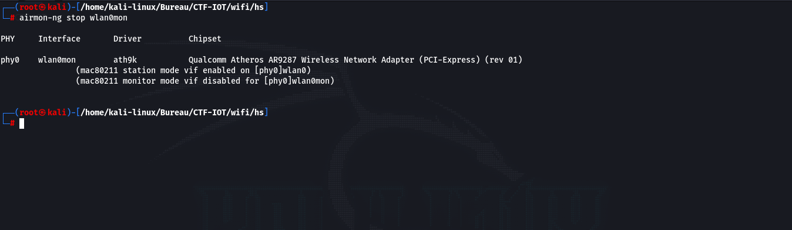

# Infiltration dans le reseau WIFI

Sommaire:

1. [Avant propos](#1-avant-propos)
2. [Rappel du sujet](#2-rappel-du-sujet)
3. [Attaque sur le WIFI](#3-attaque-sur-le-wifi)
	1. [Scanner les réseaux Wifi](#31-scanner-les-reseaux-wifi)
	2. [Récuper les tree handcheck](#32-recuper-les-tree-handcheck)
	3. [Brutforce le mot de passe du réseau Wifi](#33-brutforce-le-mot-de-passe-du-reseau-wifi)

## 1. Avant propos

Pour infiltrer le réseau WiFi, une machine équipée d’une carte réseau est nécessaire. Si vous utilisez une machine virtuelle, assurez-vous d’utiliser une clé USB WiFi dans la VM. Dans cette section, nous avons opté pour une machine Kali Linux comme système d’exploitation, permettant l’utilisation directe de la carte WiFi. Si vous préférez éviter la
création d’un dual-boot, vous pouvez utiliser une clé USB bootable avec Kali Linux en mode live, évitant ainsi tout impact sur votre système existant.

## 2. Rappel du sujet

***La mission est d'entrer dans la salle des 4AS (option à l'INSA CVL en STI) afin de pouvoir brancher un Keylogger sur la machine de l'enseignant et pouvoir récupérer son mot de passe pour pouvoir changer ça note obtenue et avoir la moyenne. Comme vous ête dans l'option 2SU, vous avez une porte qui mène directement dans la salle des 4AS, mais cette enseignant, suite à des problèmes entre des éleves à mis en place un système de carte surveillé par une caméra pour que seulement les professeurs puissent passer par la porte.***

***Pour que cette attaque soit indétectable, vous devez passer devant la caméra sans être vu, puis trouver un moyen de pirater le système de carte et ainsi ouvrir la porte.***

Dans cette section, l’objectif est d’infiltrer le réseau WiFi pour comprendre le fonctionnement de la caméra. Vous avez observé votre enseignant entrer le mot de passe WiFi devant vous, bien que vous n’ayez pas enregistré toutes les touches. Cependant, vous savez que le mot de passe suit le format : `2SU-XX-YZ-ZZ`, avec `X = caratère majustcule`, `Y = caractère minuscule`, `Z = chiffre`.

## 3. Attaque sur le WIFI

### 3.1. Scanner les réseaux Wifi

Pour débuter, nous devons scanner les différents réseaux WiFi. Pour cette attaque, nous avons utilisé la commande `wifite`, qui permet d’effectuer des attaques sur les réseaux WiFi. Nous lançons la commande, laquelle va scanner les réseaux WiFi disponibles.

Une fois que le réseau WiFi ciblé est visible dans la liste, appuyez sur les touches `Ctrl+C` pour arrêter le scan.

### 3.2. Récuper les tree handcheck

Après avoir obtenu la liste des réseaux WiFi disponibles, sélectionnez le réseau sur lequel vous souhaitez effectuer l’attaque.

Dans notre cas, nous avons sélectionné le réseau numéro 1. L’attaque se fait donc sur le réseau ciblé. `Wifite` va écouter les paquets liés à ce réseau pour identifier les appareils connectés. Une fois ces appareils trouvés, ils seront déconnectés à l’aide d’une faille dans le protocole WPA2. Ensuite, `wifite` écoute comment les appareils se reconnectent, nous
permettant de récupérer les trois poignées de main de la connexion. À cette étape, nous n’avons plus besoin d’être à proximité du routeur WiFi car avec les trois poignées de main, nous pouvons effectuer des attaques par dictionnaire ou par force brute en local (c’est ce que `wifite` tente de faire sans succès).

Pour la suite, il faudra se connecter au réseau WiFi, mais il se peut que `wifite` ne réussisse pas à restaurer les paramètres de la carte WiFi, la rendant normalement inutilisable. Si vous avez une carte réseau `wlan0mon`, vous êtes concerné par ce problème. Il faut exécuter la commande suivante pour revenir à la normale.

### 3.3. Brutforce le mot de passe du réseau Wifi

Nous allons maintenant tenter de trouver le mot de passe WiFi localement en récupérant le fichier généré par wifite et en le convertissant pour hashcat via le lien suivant : : [hashcat.net](https://hashcat.net/cap2hashcat/)

Avec ce fichier, nous pouvons maintenant effectuer une attaque par force brute sur le mot de passe avec`hashcat`, connaissant le schéma du mot de passe :

`2SU-XX-YZ-ZZ`

Avec :
 - X = caractère en majuscule
 - Y = caractère en minuscule
 - Z = chiffre

Ce qui donne pour cette attaque : $26 * 26 * 26 * 9 * 9 * 9 = 12812904$ possibilités.

Nous utiliserons la commande suivante pour utiliser hashcat en lui fournissant le schéma du mot de passe et tenter de le trouver.

Nous avons donc trouvé le mot de passe en  `2 min et 32 secondes` (ce temps varie en fonction de la puissance de calcul de votre machine).

Vous pouvez visualiser le mot de passe via la commande :

Il ne nous reste plus qu’à nous connecter au réseau WiFi avec le mot de passe obtenu.
