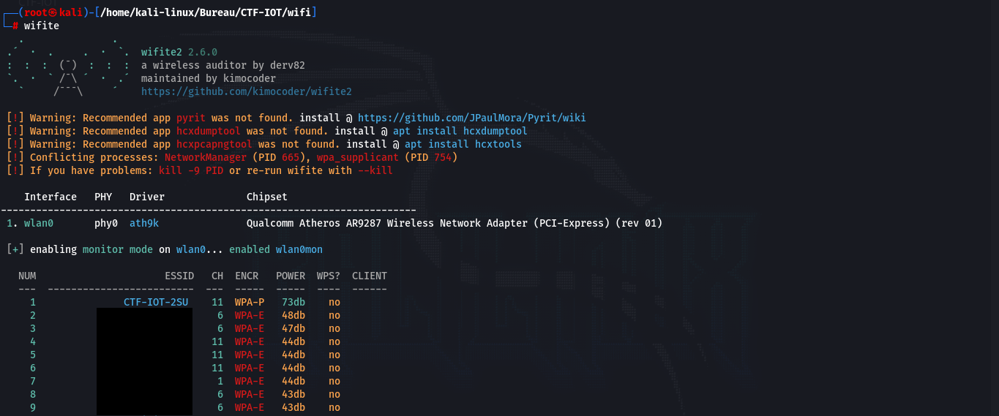
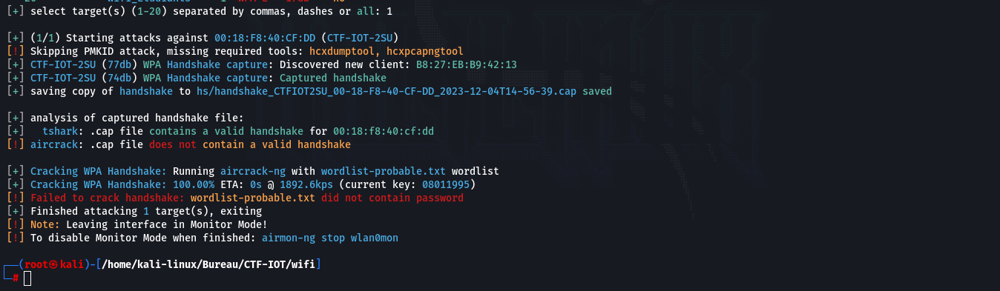
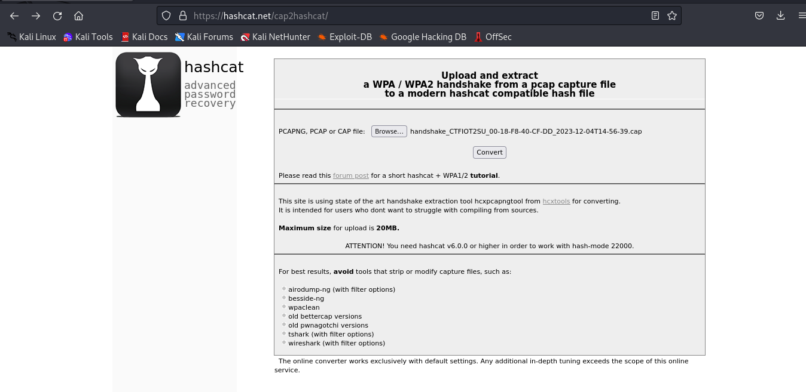
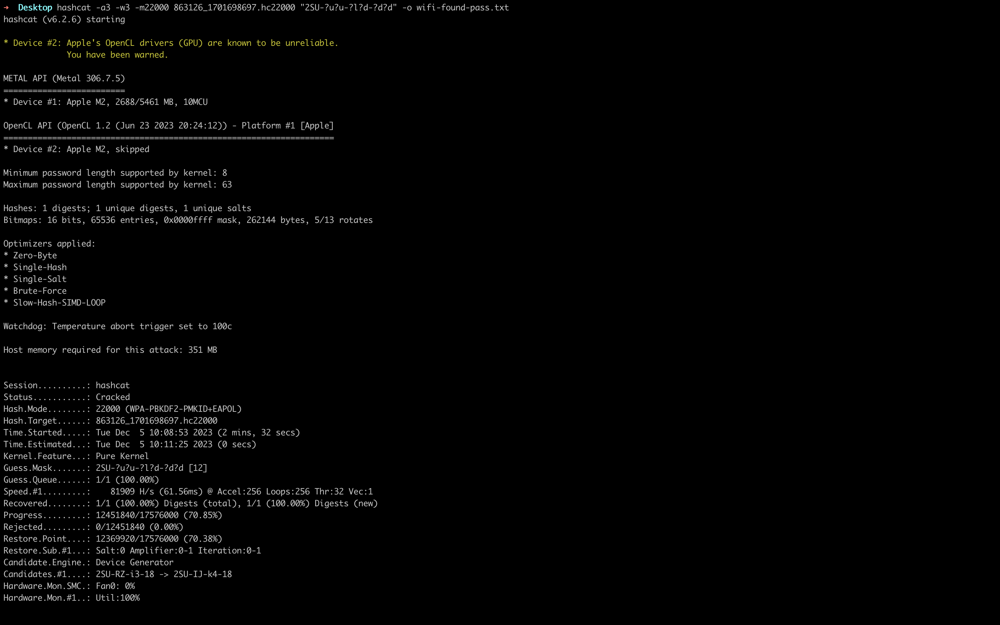
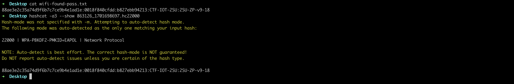

# Infiltration dans le reseau WIFI

## 1. Avant propos

Pour s'infiltrer sur le réseau Wifi, il faut au préalable avoir une machine qui permet de faire les attaques, qui dispose d'une carte réseau. Si c'est sur une machine virtuel, il faut utiliser un clef USB Wifi dans la VM. Dans cette partie, nous avons utilisé une machine Kali-linux comme OS du système ce qui permet d'utiliser la carte Wifi directement. Si vous voulez utiliser cette méthode sans créer de dual-boot, vous pouvez utiliser une clef USB bootable avec KaliLinux, et démarrer en mode live sur la clef USB, ce qui va vous permettre de faire les même étapes sans causer de problème sur votre système.

## 2. Rappel du sujet

***La mission est d'entrer dans la salle des 4AS (option à l'INSA CVL en STI) affaint de pouvoir brancher un Keylogger sur la machine de l'enseignant et pouvoir récupérer sont mot de passe pour pouvoir changer ça note obtenue et avoir la moyenne. Comme vous ête dans l'option 2SU, vous avez une porte qui mène directement dans la salle des 4AS, mais cette enseignant, suite à des problème entre des éleves à mis en place un système de carte surveillé par une caméra pour que seulement les profésseur puissent passer par la porte.***

***Pour que cette attaque soit indétectable, vous devez passer devant la caméra sans être vu, puis trouver un moyen de pirater le système de carte et ainsi ouvrir la porte.***

Dans cette partie, vous allez infiltrer le réseau Wifi pour pouvoir identifier le fonctionnement de la camèra. Vous avez vu votre enseignant taper le mot de passe du Wifi devant vous, mais vous n'avez pas enregister toutes les touches mais vous savez que le mot de passe est sous la forme : `2SU-XX-YZ-ZZ`, avec `X = caratère majustcule`, `Y = caractère minuscule`, `Z = chiffre`.

## 3. Attaque sur le WIFI

### 3.1. Scanner les réseaux Wifi

Pour commancer, nous devons scanner les différents réseau Wifi. Pour faire cette attaque, nous avons utiliser la commande `wifite` qui permet de faire des attaques sur les réseaux Wifi. Nous commençons par executer la commande, cette dernière va scanner les réseau Wifi disponibles.

Une fois que le Wifi cible est visible dans la liste, il faut appuyer sur les touche `Ctrl+C` pour stopper le scan.

### 3.2. Récuper les tree handcheck

Une fois que nous avons la liste des wifi disponible, il faut selectionner le réseau sur lequel nous voulons mener l'attaque.

Dans notre cas, nous avons selectionné le réseau numéro 1. L'attaque ce fait donc sur le réseau ciblé. Pour ce faire, `wifite` va écouter les paquêtes qui concerne ce réseau pour identifier des appareils connecté à ce réseau. Une fois des machines trouvé, les machines vont être déconnecté (a l'aide d'une fail dans le protocole WPA2). Pour finir `wifite` va écouter comment les appareil vont se reconnecter. De cette manière nous allons récupérer les trois poignet de main de la connection. A cette étapes, nous n'avons plus besoin d'être a proximité du routeur Wifi car avec les trois poignet de main, nous pouvons faire des attaques par dictionnaire ou par brutforce en local (c'est ce que `wifite` tante de faire sans sucess).

Pour la suite, il faudrat se connecter au réseau Wifi, mais il ce peut que `wifite` ne réussise pas à modifier les paramètre de la carte Wifi qu'il mis en place ce qui rend la carte inutilisable normalement. Si vous avez une carte réseau `wlan0mon`, vous ête concerné par ce problème, il faut faire la commande suivante pour revenir à la normal.

### 3.3. Brutforce le mot de passe du réseau Wifi

Nous allons maintenant en local, tanter de trouver le mot de passe du Wifi. Pour ce faire, il faut récupérer le fichier générer par `wifite` et le convertir pour `hashcat`. Pour ce faire, vous pouvez utiliser le lien suivant qui permet d'utiliser une commande en ligne de conversion qui n'est plus forcément disponible sur kali-linux : [hashcat.net](https://hashcat.net/cap2hashcat/)

Avec ce fichier nous pouvons maintenant brutforce le mot de passe avec `hashcat`. Comme nous connaissons le schéma du mot de passe.

`2SU-XX-YZ-ZZ`

Avec :
 - X = caractère en majuscule
 - Y = caractère en minuscule
 - Z = chiffre

Ce qui donne pour cette attaque : $26 * 26 * 26 * 9 * 9 * 9 = 12812904$ possibilités.

Avec la commande suivant, nous allons utiliser `hashcat` en lui donnant le schéma du mot de passe pour tanter de trouver le mot de passe.

Nous avons donc trouver le mot de passe en `2 min et 32 secondes` (ce temps varie en fonction de la puissance de calcule de votre machine).

Nous avons donc le mot de passe que nous pouvons visualiser via la commande :

Il ne nous reste plus qu'a nous connecter au réseau Wifi avec le mot de passe obtenue.
