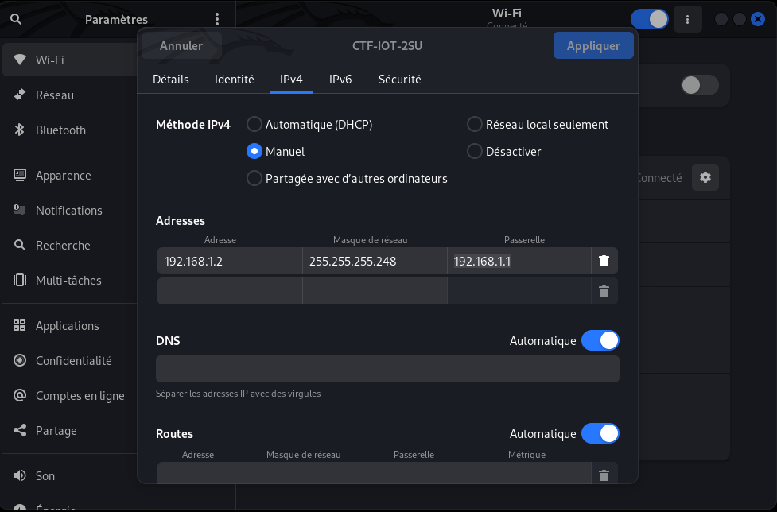
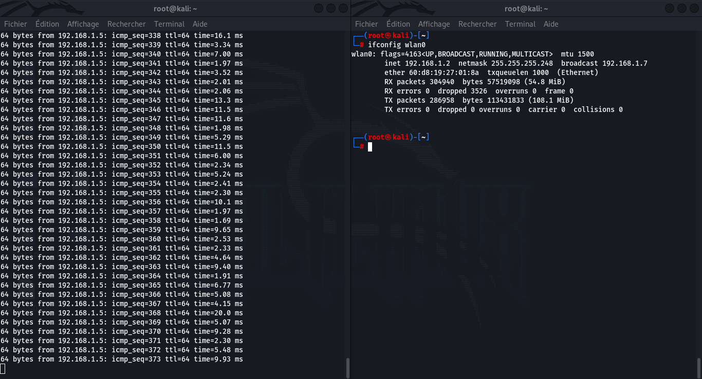

# Attaque sur la camera

Sommaire:

1. [Rappel du sujet](#1-rappel-du-sujet)
2. [Remplacer la caméra](#2-remplacer-la-camera)
	1. [Intércepter une image](#21-intercepter-une-image)
	2. [IP usurpation](#22-ip-usurpation)
	3. [Envoyer des images](#23-envoyer-des-images)

## 1. Rappel du sujet

***La mission est d'entrer dans la salle des 4AS (option à l'INSA CVL en STI) affaint de pouvoir brancher un Keylogger sur la machine de l'enseignant et pouvoir récupérer sont mot de passe pour pouvoir changer ça note obtenue et avoir la moyenne. Comme vous ête dans l'option 2SU, vous avez une porte qui mène directement dans la salle des 4AS, mais cette enseignant, suite à des problème entre des éleves à mis en place un système de carte surveillé par une caméra pour que seulement les profésseur puissent passer par la porte.***

***Pour que cette attaque soit indétectable, vous devez passer devant la caméra sans être vu, puis trouver un moyen de pirater le système de carte et ainsi ouvrir la porte.***

Maintenant que nous avons trouvez comment les Raspberry PI communique, il faut que nous puissions passer devant la caméra sans être détecté, et sans être détecter par l'indicateur limineux qui detect la coupure réseau entre les deux Raspberry PI.

## 2. Remplacer la caméra

Dans cette solution, nous allons faire en sorte que les images transmit à la Raspberry PI `protected door` soit les mêmes que la caméra enverrais (il serait possible d'envoyer des images personnaliser).

### 2.1. Intércepter une image

Pour cette première étapes, nous allons intercepter une image transmise par la caméra pour ensuite pouvoir la retransmettre par la suite.

Le code `srcs/get_payload.py` permet d'intercepter toute les communications qui passe par la carte réseau. Lorsqu'il y a une nouvelle connection de `cam` vert `protected door`, il faut vérifier si la trame contient le premier packet de l'image. Cela est possible car le paquête est sous la forme :

```text
1BFC
--BoundaryString
Content-type: image/jpeg
Content-Length:      7089

...
```

Nous avons la chaine `--BoundaryString` qui est toujours dans le premier paquête de l'image et qui reste constant, nous pouvons donc nous baser sur cela pour l'identifier.

Ensuite, comme nous avons la taille de l'image dans le `Content-Length`, nous pouvons compter le nombre de données reçu pour identifier si nous avons reçue l'image au complet, et ainsi sauvegarder l'image intercepté.

Pour finir, le code permet de faire la passerelle entre les deux machine en changeant les addresses MAC avant de les transmettre.


Donc pour pouvoir exéuter le code il faut suivre les étapes suivante.

Pour commencer sur deux terminal, il faut exécuter ces deux commande pour faire un Man-In-The-Middle.
```bash
# Premier terminal
$ arpspoof -i wlan0 -t 192.168.1.2 192.168.1.5
```

```bash
# Second terminal
$ arpspoof -i wlan0 -t 192.168.1.5 192.168.1.2
```

Il ne faut pas activer le forwarding sur la machine car le code le fait à la place.
```bash
$ echo 0 > /proc/sys/net/ipv4/ip_forward
``` 

Puis pour finir, il faut exécuter le code python qui intercepte l'image:
```bash
$ python3 get_payload.py
.
Send 1 packets.
.
Send 1 packets.
.
Send 1 packets.
.
Send 1 packets.
.
Send 1 packets.
.
Send 1 packets.
.
Send 1 packets.
Image sniffing with 7089 size
.
Send 1 packets.
.
Send 1 packets.
.
Send 1 packets.
.
Send 1 packets.
Saving of payload size of 7089
.
Send 1 packets.
.
Send 1 packets.
...
``` 

A cette étapes, nous pouvons arréter tous les terminaux, car nous avons un fichier qui se nomme `payload.bin` qui est généré qui contient la première image transmis par la caméra.

### 2.2. IP usurpation

Maintenant que nous avons l'image que nous voulons transmettre il faut pouvoir se faire passer pour la `cam` et pour cela, nous allons changer notre adresse IP pour obtenir celle de la caméra.

Pour cette étapes nous allons commencer par transmettre au router des paquêtes ARP pour lui indiquer que l'adresse IP `192.168.1.2` est associé à notre adresse MAC.

```bash
# premier terminal
$ arpspoof -i wlan0 -t 192.168.1.1 192.168.1.2
```

Ensuite, nous allons faire des ping en continue à `protected door` pour deux raison. La premier est pour lui que lors du changement de l'adresse IP, il associe l'adresse MAC à l'adresse IP pour ne pas continuer à envoyer des paqêtes à `cam`. Et la seconde raison est pour savoir si le changement de l'adresse IP à étais accépté par le switch (si le ping continue cela permet de savoir que nous avons bien récupéré l'IP se qui rend inaccéssible `cam`).

```bash
# second terminal
$ ping 192.168.1.5
```

Mainteant que ces commandes sont exécuté, nous pouvons attendre quelque minutes avant de faire le changement de l'adresse IP.

A cette étapes, la communication ce produit encore sans que la LED Orange ne s'allume (led de détection de coupur réseau entre `cam` et `protected door`).

Il suffit maintenant de changer les paramètres wifi comme sur l'image ci-dessous.



Puis de déconnecter puis reconnecter le wifi. Pour véfier que l'usurpation c'est bien produite, nous pouvons vérifier que nous avons bien l'adresse IP `192.168.1.2`, que le ping continue à ce faire, et pour finir que la LED Orange c'est allumé.



Pour la suite de cette attaque, nous pouvons garder le terminal qui fait des ping en activité.

### 2.3. Envoyer des images

Maintenant que nous avons obtenue l'IP `192.168.1.2`, nous pouvons maintenant utiliser le code `srcs/cam.py` qui permet d'ouvrire une socket sur le port `8081`, et de transmettre en boucle l'image que nous avons intercepté précédament.

```bash
$ python3 cam.py
Server UP at 0.0.0.0:8081
Connection de ('192.168.1.5', 54294)
Connection de ('192.168.1.5', 54308)
Connection de ('192.168.1.5', 33808)
...
```

Maintenant nous nous faisons passer pour `cam` donc nous pouvons passer devant la caméra sans que cela ne soit détécté.

--------------------------------------------------------------------------------------

--------------------------------------------------------------------------------------

La première image montre que la LED orange est allumé avant l'envoie des images.


Puis une fois les images en envoie, la LED allumé est la verte qui correspond au faite que personnes n'est devant la caméra.


Nous pouvons mainteant continuer notre attaque en essayant d'ouvrir la porte.
