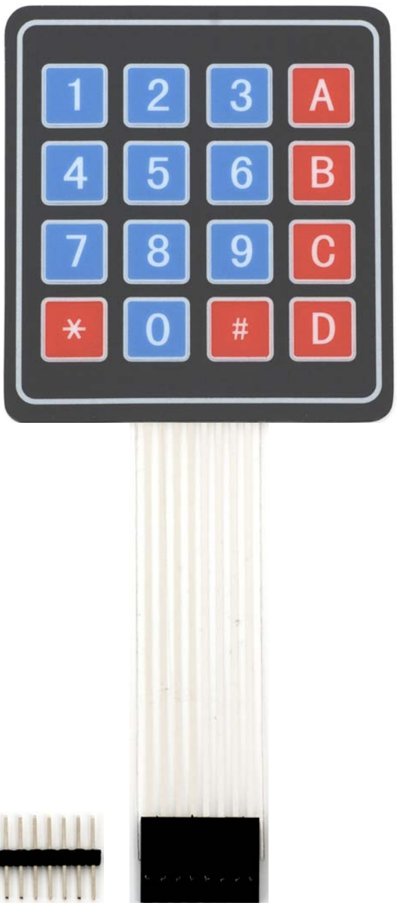
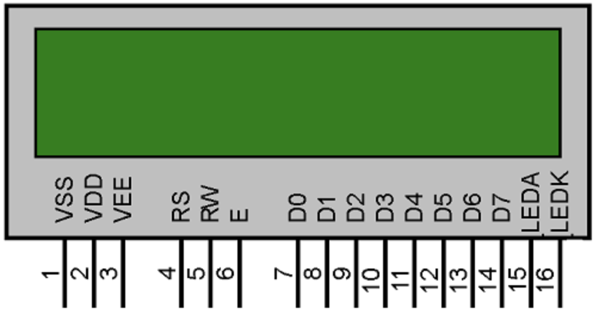
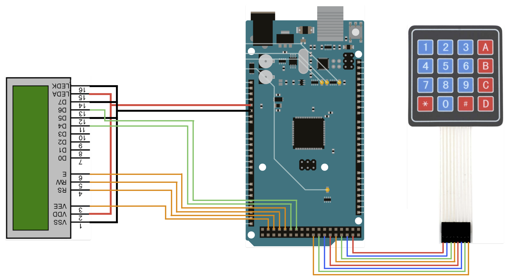

# IHM du lecteur de carte

Sommaire:

- [Présentation des modules](#presentation-des-modules)
- [Câblage des différents élements](#cablage-des-differents-elements)
- [Tranférer le code vers la carte Arduino](#tranferer-le-code-vers-la-carte-arduino)
- [Touche du Keypad](#touche-du-keypad)

Dans cette section, nous explorerons l’utilisation de la carte Arduino MEGA pour créer une interface homme-machine (IHM) permettant d’interagir avec le lecteur de carte. Le schéma ci-dessous illustre la disposition des broches de la carte Arduino MEGA utilisée dans ce projet.

Cette carte permettra à l’utilisateur d’une carte à puce d’entrer un code, puis d’afficher les informations du système de carte à puce.

## Présentation des modules

Pour implémenter cette IHM, nous disposons d’un clavier matriciel (keypad).

Ce dernier sera utilisé par la carte pour récupérer le code de l’utilisateur via ce keypad.

Nous disposons également d’un afficheur LCD qui permet d’afficher les différentsmessages que la Raspberry Pi transmet lors de la communication. Cela offre une information visuelle à l’utilisateu

## Câblage des différents élements

Le schéma ci-dessous permet de visualiser le câblage effectué pour que ce soit compatible avec le code (En cas de changement du câblage, il faut en conséquence modifier le code).

## Tranférer le code vers la carte Arduino

Le code à téléverser dans la carte Arduino est disponible dans le répertoire [`arduino_mega_IHM_card_reader`](./arduino_mega_IHM_card_reader/arduino_mega_IHM_card_reader.ino). Il faut ouvrir ce programme avec [l'IDE Arduino](https://www.arduino.cc/en/software).

Pour que le code puisse compiler, effectuez les manipulations suivantes dans l’IDE Arduino :
`Sketch > Include Library > Add .ZIP Library...`, znsuite, une fenêtre s’affichera, où vous devrez ajouter le fichier [`Keypad.zip`](./ressource/Keypad.zip) présent dans le répertoire [`ressource`](./ressource/Keypad.zip).

Une fois cette bibliothèque importée, branchez la carte et téléversez le code vers cette dernière. Ainsi, l’IHM est disponible pour le challenge.

## Touche du Keypad

Le Keypad a pour but de transmettre le code de l’utilisateur à la Raspberry Pi. Pour ce faire, l’utilisateur sélectionne les numéros de son code, puis valide le code avec la touche `A`. En cas d’erreur dans le code, il est possible de supprimer le dernier chiffre avec la touche `D`.
