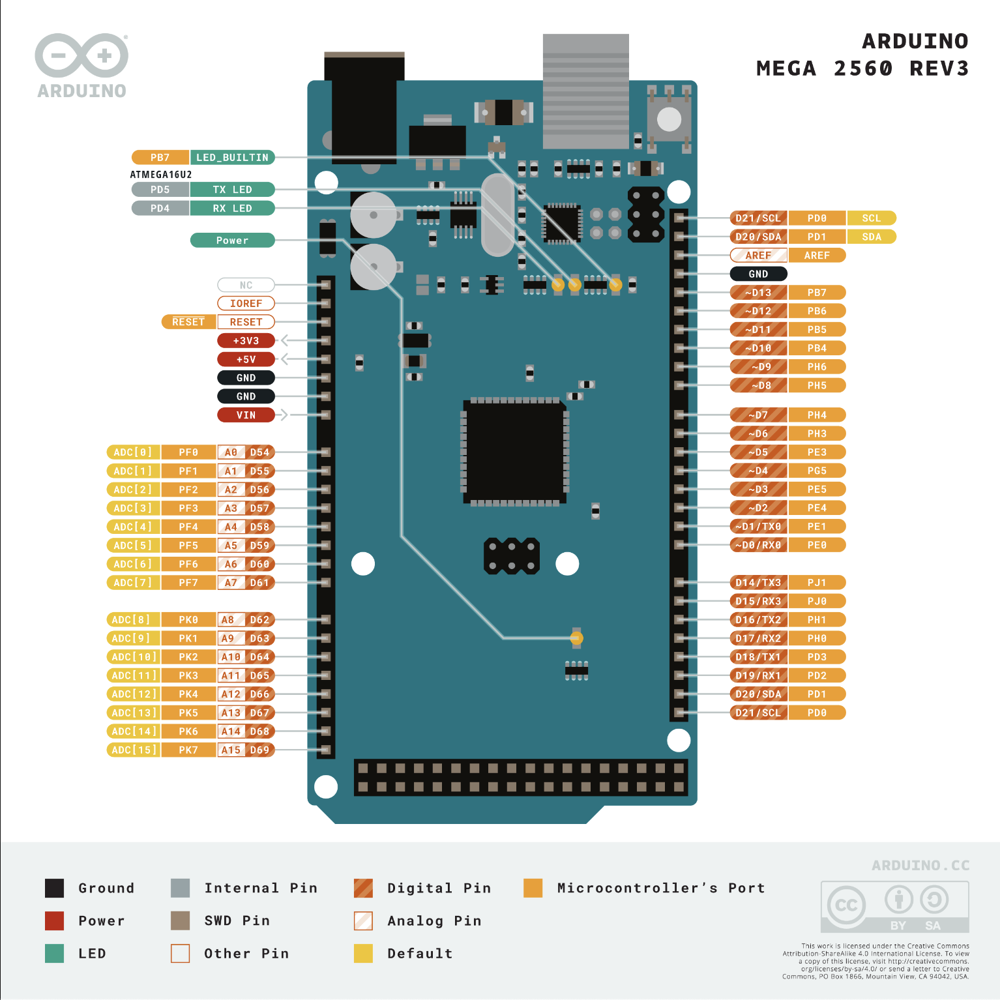

# IHM du lecteur de carte

Dans cette partie, nous allons voir comment la carte Arduino MEGA est utilisé pour réaliser une IHM pour povoir intéragir avec le lecteur de carte. Le schéma ci-dessous contient la schématisation des pins de la carte Arduino MEGA utilisé dans ce projet.

Cette carte va permettre à l'utilisateur d'une carte à puce de pouvoir entrer un code, puis ensuite de pouvoir avoir un affichage des informations du système de carte à puce.

Pour pouvoir compiler le code, il faut ajouter dans l'IDE d'arduino la librairie en zip qui se nomme `Keypad.zip`, il suffit ensuite de téléverser le code dans la carte.

Une fois que le code est loader dans la carte, il faut maintenant faire le cablage des élements (la carte dois bien être débrancher pour faire le câblage).

Le schéma ci-dessous permet de visualiser le câblage effectuer pour que ce soit compatible avec le code (En cas de changement du câblage, il faut en consaicance modifier le code).
