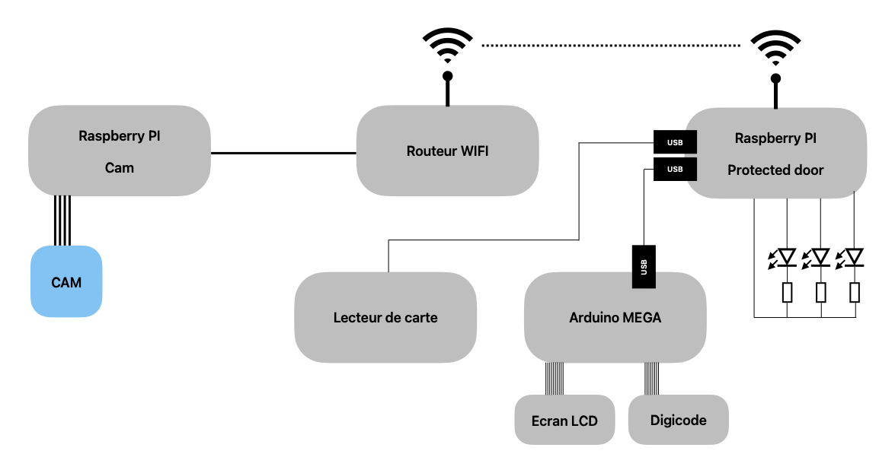

# Mise en place du challenge Mission Impossible

Pour ce défi, plusieurs éléments physiques doivent être mis en place. Cette section fournit la procédure détaillée pour configurer le challenge, avec toutes les explications disponibles dans les dossiers spécifiques de chaque dispositif du défi.

Une représentation schématique du défi est disponible dans l’image ci-dessous.

## Liste des élements pour mettre en place le système

Pour mettre en place ce système, il est nécessaire de disposer de plusieurs équipements. Toutes les explications relatives à ce système sont conçues pour la liste suivante. En cas de changement d’équipement, il n’est pas obligatoire que les  code/script/..., ne fonctionnent pas.

Liste des éléments requis pour la mise en place :
 - Routeur Wifi Linksys
 - 2 x Raspberry PI 3 B
 - Carte Arduino MEGA
 - Un afficher LCD (16x2)
 - Un 4x4 Keypad
 - 3 LED (vert, rouge, et orange)
 - un lecteur de carte FEITIAN R301
 - 2 carte à puce
 - un cable ethernet
 - une camera raspberry PI

## Mise en place

Pour faire la mise en place du système, il faut suivre les étapes suivantes :
– Mettre en place le réseau. Pour cela, les étapes que nous avons réalisées sont disponibles dans le dossier [`network`](./network).
– Mettre en place la caméra. Pour cela, les étapes de mise en place de cette partie sont disponibles dans le dossier [`rasp_cam`](./rasp_cam). Il faut bien brancher la raspberry PI au routeur Wi-Fi et vérifier la bonne connexion avec le routeur (il n'est pas possible de communiquer avec Internet dans la configuration de ce challenge).
– Mettre en place la raspberry door protector. Pour cela, il faut suivre les étapes du dossier [`rasp_protector`](./rasp_protector). Il faut aussi vérifier la bonne connexion avec le routeur et la caméra.
– Il faut ensuite mettre en place le code de la carte Arduino MEGA en suivant les étapes du dossier [`IHM_cardreader`](./IHM_cardreader).
– Une fois toutes ces installations faites, il faut brancher la carte Arduino MEGA sur la raspberry PI [`rasp_protector`](./rasp_protector), et y brancher aussi le lecteur de carte. Si la carte Arduino n'est pas branchée au démarrage de la Raspberry PI, il est possible que le code soit stoppé. Il faut donc faire ces branchements avant de mettre la sous tension (et bien attendre quelques secondes avant de brancher le lecteur de carte).