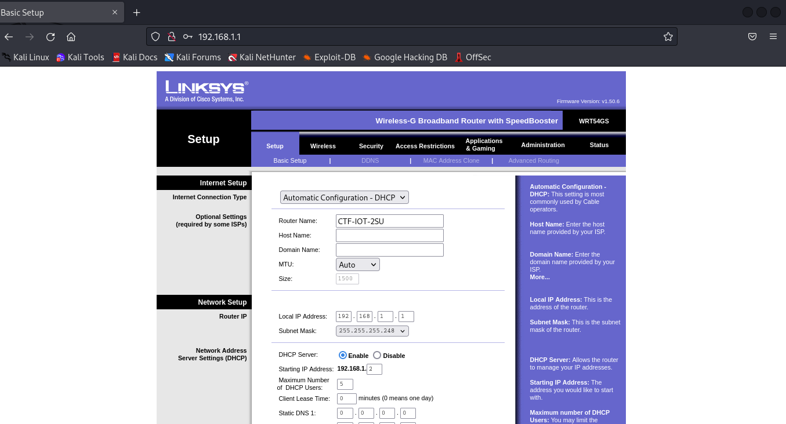
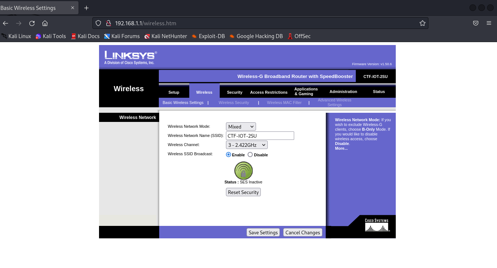
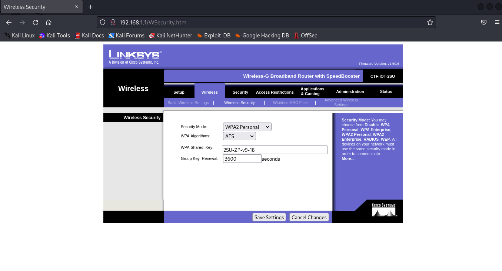
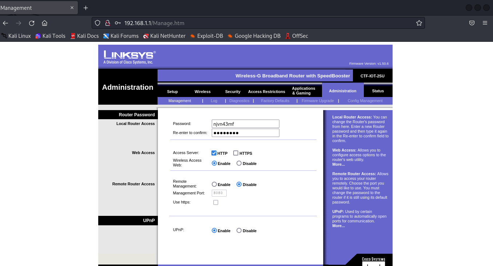

# Network

Dans cette section, nous allons voir comment nous avons fait pour mettre en place les diférents éléments en réseau.

## 1. Configuration du switch WiFi

Pour commencer, nous avions un switch Wifi ***Linksys***


Nous avons choisie de prendre comme addresse de réseau `192.168.1.0` avec un masque de sous-réseau `255.255.255.248` ce qui nous donne $2^{3} - 2 = 6$ addresse IP utilisable pour le projet. Ce nombre d'addresse IP est suffisant car nous devons avoir le switch, deux raspberry PI, ce qui laisse trois attaquant possible.

### 1.1. Configuration du réseau et du DHCP

Nous avons commencer par changer la configuration des plages d'adresse réseau du switch via l'interface d'administration du switch `username :admin; password: admin` par défaut.



### 1.2. Configuration du WIFI

Nous avons ensuite réalisé la configuration du wifi en changeant le nom du réseau wifi, puis le mot de passe du réseau.





Nous avons donc le réseau wifi `CTF-IOT-2SU` qui a pour mot de passe `2SU-ZP-v9-18`. Pour l'étape du piratage de ce mot de passe nous donnerons un format dans l'énoncer pour que ce soit plus facile à faire en brutforce, car nous voulions un mot de passe qui n'est pas dans une Wordlists mais qui soit pas trop long avec du brutforcing.

### 1.3. Configuration de l'interface admin du switch

Par la suite, nous avons pu faire le changement du mot de passe de l'admin de l'interface du switch.



Nous avons donné comme mot de passe pour la partie administrateur du switch `njvn43mf`.

## 2. Configuration des raspberry PI

Dans ce projet, nous avons deux Raspberry PI et nous devons faire en sorte que celle-ci soit dans le même réseau. Il nous faut une raspberry connecté en Wifi (pour pouvoir faire l'attaque sur le wifi et pouvoir se connecter ua réseau), et la seconde connecté en filaire.

La raspberry connecté en filaire serat la camera.

Dans la suite de se document, nous allons voir comment configurer les raspberry PI pour qu'elles soit dans le réseau mais le script d'installation ferrat cette configuration automatiquement.

### 2.1. Configurer la Raspberry PI caméra


Pour cette Raspberry PI, nous voulons avoir la comme addresse IP `192.168.1.2/29`

```bash
$ cat /etc/network/interfaces
# interfaces(5) file used by ifup(8) and ifdown(8)
# Include files from /etc/network/interfaces.d:
source /etc/network/interfaces.d/*

auto eth0
iface eth0 inet static
	address 192.168.1.2
	netmask 255.255.255.248
	gateway 192.168.1.1

$ systemctl restart networking.service
$ ifconfig eth0
eth0: flag=4163<UP,BROADCAST,MULTICAST> mtu 1500
	inet 192.168.1.2 netmask 255.255.255.248 broadcast 192.168.1.7
	inet6 fe80::8abd:8fe4:579c prefixlen 64 scopeid 0x20<LINK>
	ether b8:27:eb:f2:c3:79 txqueuelen 1000 (Ethernet)
	RX packets 268 bytes 18070 (17.6 KiB)
	RX errors 0 dropped 0 overruns 0 frame 0
	TX packets 300 bytes 29279 (28.5 KiB)
	TX errors 0 dropped 0 overruns 0 carrier 0 collisions 0

$ ping 192.168.1.1 -c3
PING 192.168.1.1 (192.168.1.1) 56(84) bytes of data.
64 bytes from 192.168.1.1: icmp_seq=1 ttl=64 time=1.52 ms
64 bytes from 192.168.1.1: icmp_seq=2 ttl=64 time=1.28 ms
64 bytes from 192.168.1.1: icmp_seq=3 ttl=64 time=1.30 ms

--- 192.168.1.1 ping statistics ---
3 packets transmitted, 3 received, 0% packet loss, time 2003ms
rtt min/avg/max/mdev = 1.277/1.363/1.517/0.108 ms
$
```

Avec ces étapes, la raspberry PI qui joue le role de la caméra et maintenant connecté dans le réseau (il se peut qu'après la commande `systemctl restart networking.service`, la raspberry n'est pas l'adresse IP attribué statiquement. Dans ce cas il faut la redémarrer `reboot`).

### 2.2. Configurer la raspberry PI protected door

Pour cette Raspberry PI, nous voulons avoir la comme addresse IP `192.168.1.3/29`

```bash
$ cat /etc/network/interfaces
# interfaces(5) file used by ifup(8) and ifdown(8)
# Include files from /etc/network/interfaces.d:
source /etc/network/interfaces.d/*

allow-hotplug wlan0
iface wlan0 inet static
	address 192.168.1.3
	netmask 255.255.255.248
	gateway 192.168.1.1
wpa-ssid CTF-IOT-2SU
wpa-psk 9f5d38db9f0533b94deb6ccc3af0330fa05a1ea49ee154593492af5af2b64e86

$ systemctl restart networking.service
$ ifconfig wlan0
wlan0: flag=4163<UP,BROADCAST,MULTICAST> mtu 1500
	inet 192.168.1.3 netmask 255.255.255.248 broadcast 192.168.1.7
	inet6 fe80::c8d:4115:6078 prefixlen 64 scopeid 0x20<LINK>
	ether b8:27:eb:b9:42:13 txqueuelen 1000 (Ethernet)
	RX packets 268 bytes 18070 (17.6 KiB)
	RX errors 0 dropped 0 overruns 0 frame 0
	TX packets 300 bytes 29279 (28.5 KiB)
	TX errors 0 dropped 0 overruns 0 carrier 0 collisions 0

$ ping 192.168.1.1 -c3
PING 192.168.1.1 (192.168.1.1) 56(84) bytes of data.
64 bytes from 192.168.1.1: icmp_seq=1 ttl=64 time=1.52 ms
64 bytes from 192.168.1.1: icmp_seq=2 ttl=64 time=1.28 ms
64 bytes from 192.168.1.1: icmp_seq=3 ttl=64 time=1.30 ms

--- 192.168.1.1 ping statistics ---
3 packets transmitted, 3 received, 0% packet loss, time 2003ms
rtt min/avg/max/mdev = 1.277/1.363/1.517/0.108 ms
$ ping 192.168.1.2 -c3
PING 192.168.1.1 (192.168.1.1) 56(84) bytes of data.
64 bytes from 192.168.1.1: icmp_seq=1 ttl=64 time=7.27 ms
64 bytes from 192.168.1.1: icmp_seq=2 ttl=64 time=4.65 ms
64 bytes from 192.168.1.1: icmp_seq=3 ttl=64 time=9.90 ms

--- 192.168.1.1 ping statistics ---
3 packets transmitted, 3 received, 0% packet loss, time 2003ms
rtt min/avg/max/mdev = 1.277/1.363/1.517/0.108 ms
$
```

Avec ces étapes, la raspberry PI qui joue le role de protection de la porte et maintenant connecté dans le réseau (il se peut qu'après la commande `systemctl restart networking.service`, la raspberry n'est pas l'adresse IP attribué statiquement. Dans ce cas il faut la redémarrer `reboot`).
