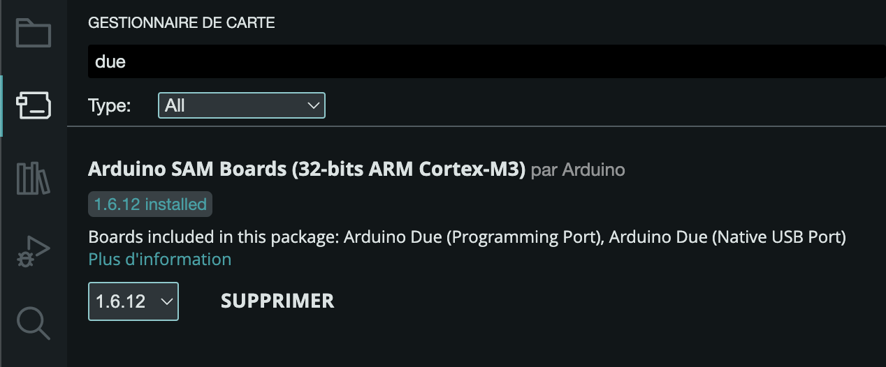
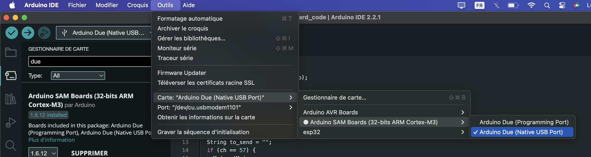
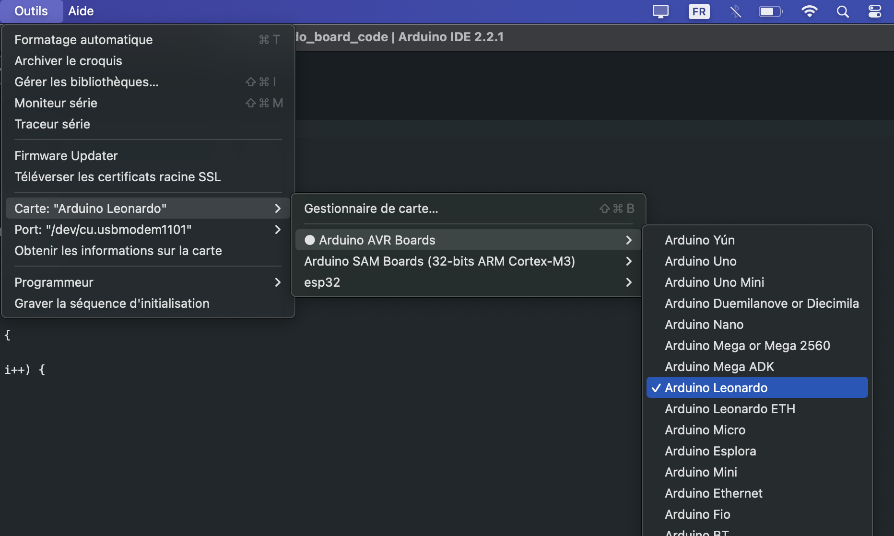
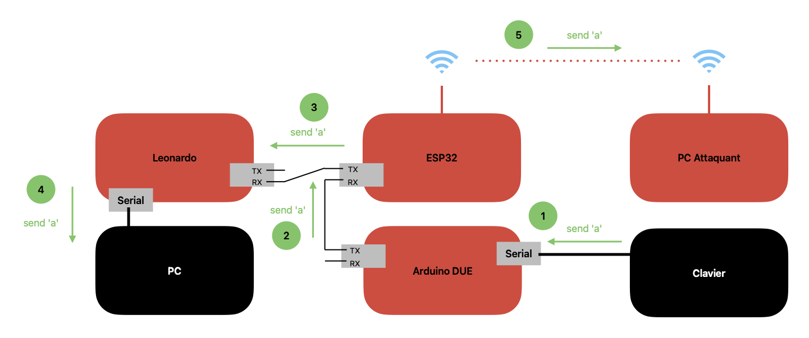
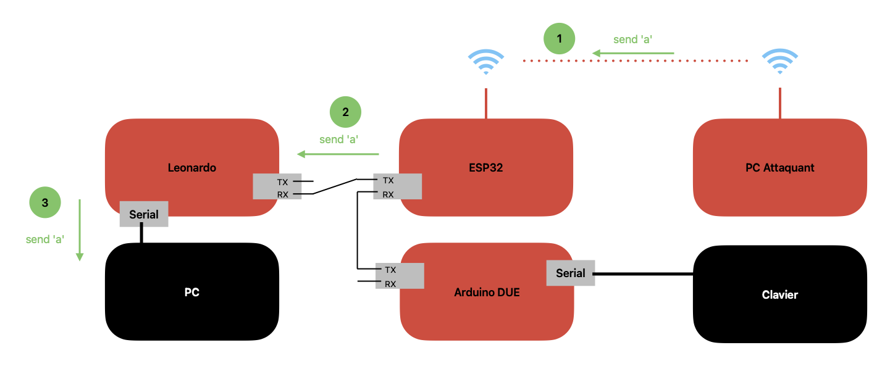

# Keylogger

Sommaire:

1. [Introduction](#introduction)
2. [Mise en place du Keylogger](#mise-en-place-du-keylogger)
    - [Transmition du code aux différentes carte](#transmition-du-code-aux-différentes-carte)
        - [ESP32](#esp32)
        - [Carte Arduino DUE](#carte-arduino-due)
        - [Carte Leonardo](#carte-leonardo)
    - [Montage du keylogger](#montage-du-keylogger)
3. [Fonctionnement du Keylogger](#fonctionnement-du-keylogger)
4. [Explication de l'utilisation du keylogger](explication-de-l'utilisation-du-keylogger)

## Introduction

Pour cette partie, nous allons faire un keylogger. Un keylogger permet d'étre branché à l'intermédiaire d'un clavier, et permet de récupérer toutes les touches qu'un utilisateur appuie sur le clavier.

```text
/!\ Ce projet est réalisé par but d'apprentissage et en auquain cas,
    ce projet ne dois être détourné pour des utilisations autres que
    sur du matériel personnel.

    Le piratage est interdit et l'ajout d'un keylogger sur du matériel
    qui ne nous partient pas est punis par la lois.
```

## Mise en place du Keylogger

Pour le keylogger que nous avons réalisé, il faut disposer de trois carte programmable différent:

- Une carte Arduio DUE
- Une carte Leonardo
- Un ESP32

Vous devez aussi disposer d'un `câble série` pour la carte Leonardo, et un `câble OTG` pour  la carte `Arduino DUE`

### Transmition du code aux différentes carte

#### ESP32

Pour mettre en place l'`ESP32`, il faut commencer par suivre le tutoriel disponible par se lien [`https://randomnerdtutorials.com/getting-started-with-esp32/`](https://randomnerdtutorials.com/getting-started-with-esp32/) pour pouvoir utiliser l'IDE Arduino pour téléverser du code sur l'ESP32.

Une fois cela effectuer, il faut ouvrir le code disponible dans le repos github : [`src/esp32_code/esp32_code.ino`](./src/esp32_code/esp32_code.ino)

Ensuite, il suffit cliquer sur le bouton de la `fleche orienté vers la droite`, pour transmettre le code dans la carte.

#### Carte Arduino DUE

Pour pouvoir compiler le code pour la carte Arduino DUE, il faut installer la librairie de l'image ci-dessous



Une fois cette librairie installe ril suffir d'ouvir le code [`src/due_board_code/due_board_code.ino`](./src/due_board_code/due_board_code.ino), et de choisir la carte DUE comme l'image ci-dessous



Il suffit maintenant de Téléverser le code en cliquant sur le bouton de la `fleche orienté vers la droite`, pour transmettre le code dans la carte.

#### Carte Leonardo

La carte Arduino est prise en compte par defaut par l'IDE Arduino, il suffit de choisir le port série de la carte, puis de choisir la carte Leonardo. Le code est diponible : [`src/leonardo_board_code/leonardo_board_code.ino`](./src/leonardo_board_code/leonardo_board_code.ino)



Il suffit maintenant de Téléverser le code en cliquant sur le bouton de la `fleche orienté vers la droite`, pour transmettre le code dans la carte.

### Montage du keylogger

Le montage des différentes carte dois être réalisé comme sur l'image ci-dessous


Le partage de l'allimentation par la `Carte Leonoardo` fonctionne pour l'`ESP32`, mais il est possible de devoir ajouter un câble d'allementation pour la `Carte DUE`

## Fonctionnement du Keylogger

Le keyloger à deux méthode de fonctionnement. La premier permet à un attaquant de pouvoir récupérer les touches que la victime va presser. Le schéma suivant présente cette méthode de fonctionnement.



La seconde méthode de fonctionnement permet à l'attaquant de transmettre des touches au PC. Le schéma suivant présente ce fonctionnement



## Explication de l'utilisation du keylogger
