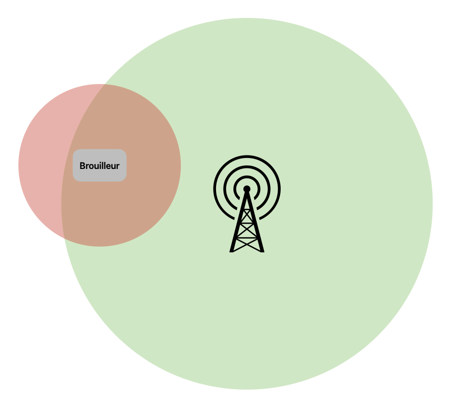

# Brouilleur d'onde radio

Sommaire:

1. [Introduction](#introduction)
2. [Mise en place du matériel](#mise-en-place-du-materiel)
3. [Brouillage d'une fréquence radio](#brouillage-dune-frequence-radio)
4. [Fonctionnement du brouilleur](#fonctionnement-du-brouilleur)
5. [Acpect légale](#acpect-legale)

## Introduction

Dans cette section sur le brouillage d’ondes, nous allons rendre indisponible une fréquence de radio FM en utilisant simplement une `Raspberry PI` et un fil que nous allons brancher
sur une broche GPIO de la `Raspberry PI`

Le code utilisé pour le brouillage est disponible via le lien GitHub :[`https://github.com/markondej/fm_transmitter`](https://github.com/markondej/fm_transmitter). Dans cette partie, nous allons utiliser ce code pour tenter de rendre indisponible une fréquence radio.

## Mise en place du matériel

Pour cette configuration, suivez les indications du [`github source`](https://github.com/markondej/fm_transmitter) qui contient les informations de branchement du fil sur la `Raspberry PI`.

Nous avons donc installé `Raspberry PI OS (Legacy) Lite` sur une `Raspberry PI 3`, puis simplement branché le fil sur le GPIO 4 de cette dernière.


## Brouillage d'une fréquence radio

Maintenant que le montage est réalisé, nous allons brouiller une fréquence radio en suivant les étapes du [`github source`](https://github.com/markondej/fm_transmitter) en utilisant la commande:

```bash
sudo ./fm_transmitter -f 89.6 -b 300 acoustic_guitar_duet.wav
```

Cela nous permet de remplacer, à la fréquence `89.6`, le son transmis en FM par le fichier audio `acoustic_guitar_duet.wav`

La vidéo suivante montre le remplacement du song de la radio

[](https://youtu.be/T1Tbs9OprG4)

Un brouilleur de manière normale, rend indisponible un service. Dans notre cas, nous effectuons un remplacement par une autre musique. Si nous voulions créer un brouilleur en rendant la radio indisponible, nous aurions dû transmettre un signal sans audio.

## Fonctionnement du brouilleur

Avec cette démonstration, on peut se demander comment il est possible de rendre une station de radio indisponible pour remplacer le son diffusé.

D’une part, nous avons une antenne radio qui transmet le son de la station de radio. Cette antenne émet des ondes radio à un certain niveau de puissance, permettant de couvrir une grande distance autour d’elle. Lorsque nous utilisons la Raspberry Pi avec le fil agissant comme une antenne pour transmettre un son, cette dernière va superposer ses
propres ondes aux ondes émises par l’antenne de la station de radio

L’image ci-dessous permet de visualiser le fonctionnement du remplacement des ondes.



Dans cette image, toutes les radios réglées sur la fréquence `89.6` et se trouvant dans la zone rouge recevront le son émis par le brouilleur.

## Dangerosité des brouilleurs

Nous avons vu par cet exemple qu’un brouilleur demande beaucoup de matériel et peut être mis en place facilement et rapidement. Dans cette démonstration, nous avons transmis une musique sur des fréquences radio FM. Cependant, que se passerait-il si nous transmettions sur la fréquence de la téléphonie mobile dans un bâtiment ?

Les brouilleurs sont efficaces sur tous les systèmes utilisant des communications sans fil, donc sur tous les téléphones, les appareils connectés, les télécommandes de garage, et bien d’autres systèmes. Avec un simple brouilleur sur la bonne fréquence, il est possible de rendre indisponible n’importe quel service.

De plus, il est difficile de contrer une attaque de brouillage. La seule solution, si elle est possible, est de sortir de la zone d’action du brouilleur. Néanmoins, les brouilleurs sont facilement localisables ; en déterminant trois points à la bordure du champ d’action du brouilleur, il est possible de trianguler la source.

## Acpect légale

En France, la détention, l’utilisation, et la commercialisation de dispositifs destinés;à rendre inopérants des équipements radioélectriques ou des appareils intégrant des équipements radioélectriques de tous types, tant pour l’émission que pour la réception,
sont interdites.

En cas d’utilisation d’un brouilleur, la peine encourue est de six mois d’emprisonnement et de 30 000 euros d’amende.

Source de ces informations (lors de la rédaction de ces informations) :

- [https://www.legifrance.gouv.fr/codes/article_lc/LEGIARTI000024506235/](https://www.legifrance.gouv.fr/codes/article_lc/LEGIARTI000024506235/)
- [https://www.legifrance.gouv.fr/codes/id/LEGIARTI000031318701/2024-01-13/#LEGIARTI000031318701](https://www.legifrance.gouv.fr/codes/id/LEGIARTI000031318701/2024-01-13/#LEGIARTI000031318701)

Il est néanmoins possible d’utiliser des fréquences radio en France. Certaines sont dédiées à des stations, et certaines fréquences, comme celles du Wifi, sont soumises à des règles d’utilisation de la fréquence. Il est toutefois possible d’utiliser des fréquences qui sont en libre accès.
