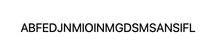
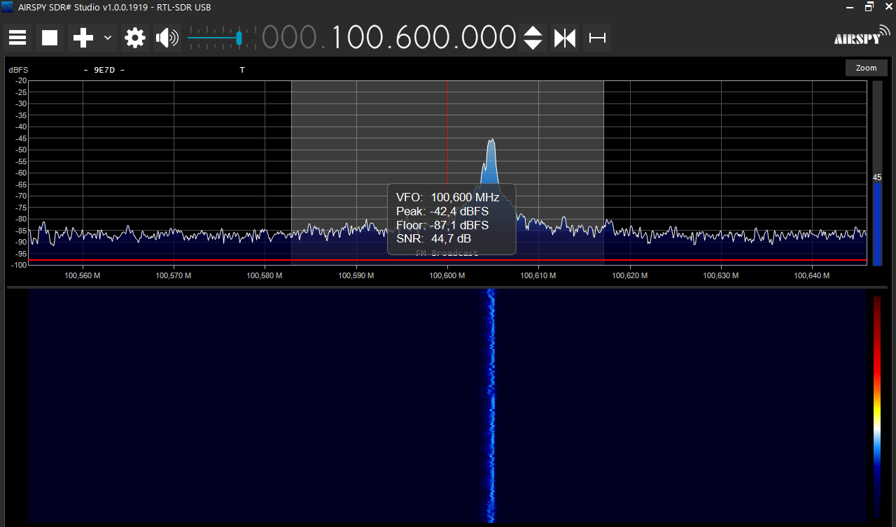
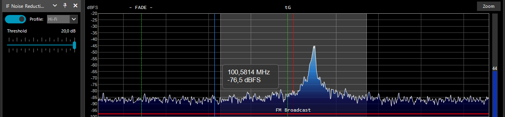
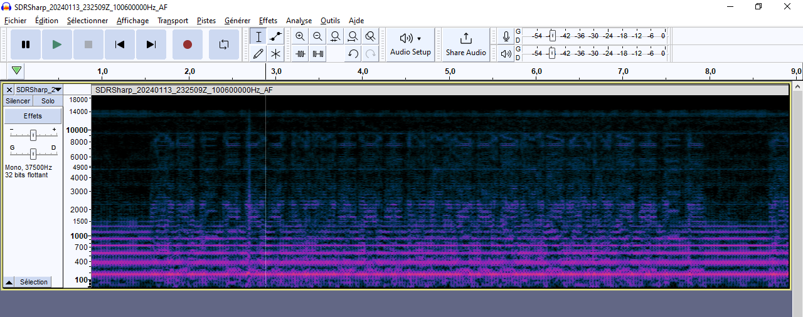
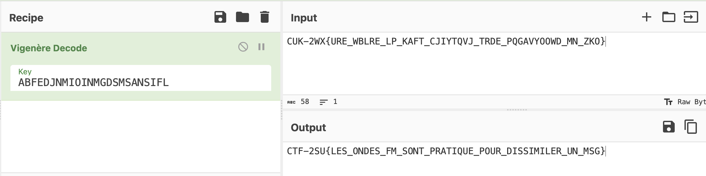

# Mini challenge d'onde

Sommaire:

- [Introduction](#introduction)
- [Sujet du challenge](#sujet-du-challenge)
- [Mise en place du challenge](#mise-en-place-du-challenge)
- [Solution du challenge](#solution-du-challenge)

## Introduction

Dans cette partie, nous avons proposons un challenge qui porte sur les ondes. L'objectif de ce challenge est de réussir un récupérer une clef de chiffrement qui permet déchiffrer un message.

Pour ce challenge, vous devez disposer d'une `Raspberry PI 3 B` avec `Raspberry PI OS (Legacy) Lite` installer sur cette dernière. Il vous faut aussi un fils.

Pour pouvoir résoudre le challenge, vous devez disposer d'une antenne ***DVB-T+FM+DAB 820T2 & SDR*** et pour notre solution d'un ordinateur sur Windows.

## Sujet du challenge

Nous avons trouvé un appareil suite à une apparition d'une chaine de radio. Lorsque nous avons trouvé l'appareil, nous avons réussie à récupérer un message.

```text
CUK-2WX{URE_WBLRE_LP_KAFT_CJIYTQVJ_TRDE_PQGAVYOOWD_MN_ZKO}
```

Quand cette appareil est branché, la station radio est rendu disponible mais le sonf transmit n'est pas compréhenssbile. Votre mission est de trouver un moyen de comprendre ce qui est transmit par la station radio sur la fréquence `100.6`, et trouver un moyen de lire le message que nous avons récupéré.

## Mise en place du challenge

Pour mettre en place le challenge, il faut suivre la mise en place décrit dans la partie du [brouilleur d'onde](../brouilleur_d-onde) sans télécharger le code github car un autres code sera utilisé.

Une fois la `Raspberry PI` muni de l'antenne faite à partir du fils, nous pouvons réaliser la suite du challenge. Pour commencer, nous devons réaliser un audio qui contient la clef du chiffrement. Pour ce faire nous avons utilisé le code disponible sur github [`https://github.com/solusipse/spectrology`](https://github.com/solusipse/spectrology).

Mais avant cela, nous avons réaliser une image au format bmp pour avoir la compatibilité avec le code github. L'image utilisé est la suivant convertie en bmp via un convertisseur en ligne disponible dans le dossier [`ressources`](./ressources/clef.bmp)



```bash
git clone https://github.com/solusipse/spectrology.git
cd spectrology
python spectrology.py ~/Desktop/clef.bmp -b 13000 -t 19000 -o ~/Desktop/clef.wav
```

De cette manière nous avons transfomé le fichier `clef.bmp` en fichier audio `clef.wav` disponible dans le dossier [`ressources`](./ressources/clef.wav).

Nous pouvons maintenant procèder a la mise en place de ces différents éléments sur la `Raspberry PI`. Pour cela, vous pouvez exécuter les commande suivante en tant que `root`, et transmettre le fichier `clef.wav` généré précédament. Nous allons utiliser le code github [`https://github.com/ChristopheJacquet/PiFmRds`](https://github.com/ChristopheJacquet/PiFmRds) pour transmettre la clef via les ondes FM.

```bash
git clone https://github.com/ChristopheJacquet/PiFmRds
cd PiFmRds/src
make clean
make
```

Puis nous allons modifier le fichier `/etc/rc.local` pour pouvoir exécuter le code au démarrage de la `Raspberry PI`. La lignes est rajouté avant la ligne `exit 0`.

```text
/root/pi_fm_rds -audio /root/clef.wav -ps CTF-2SU -rt "CTF IOT" -freq 100.6 &
```

De cette manière lors du redémarrage de la `Raspberry PI`, le challenge sera disponible. Nous pouvons mainteant passer à ça résolution.

## Solution du challenge

Nous pouvons maintenant passer à la résolution du challenge. Pour cela, nous avons une antenne ***DVB-T+FM+DAB 820T2 & SDR***. Nous allons installer le logiciel airspy qui permet de visualiser ce que l'antenne reçoie, le logiciel est [`airspy`](https://airspy.com/download/) (Dans le cas ou l'antenne n'est visible, cette [`video`](https://www.youtube.com/watch?v=j14irB3spPc) peut vous permettre de résoudre cela).

Nous avons donc l'antenne de branché avec le logiciel `airspy`. Nous pouvons scanner la fréquence `100.6`.



Cette fréquence rend disponible un song qui semble se répéter mais n'est pas compréhenssible. Nous allons ajouter des filtres de diminution de bruits parasite (en haute fréquence) du à l'environnement environnement.



Puis nous allons faire un enregistrement de la sequence sur cette fréquence en suivant les étapes suivante : `Selectionner l'icon des trois trait horizontal > Audio: Simple Recorder`, puis lancé un enregistrement pour avoir au moins une sequence. Une fois cela effectuer, vous pouvez utiliser `Audacity` pour ouvrir cette audio.

Nous pouvons maintenant importer cette audio réalisé sur `audacity`. Sur `Audacity`, vous pouvez changer l'apparance de l'audio pour avoir un spectrogramme ce qui nous permet d'avoir ce visualisation suivante.



Nous pouvons avec ce spectrogramme visualiser des caractères donne la chaine

```text
ABFEDJNMIOINMGDSMSANSIFL
```

Nous devons maintenant déterminer ce que le message cache. Pour cela, nous pouvons utiliser un site qui permet de déterminer le chiffrement probablement utilisé [`https://www.dcode.fr/identification-chiffrement`](https://www.dcode.fr/identification-chiffrement).


Nous pouvons déterminer que le chiffrement utiliser est probablement le `chiffrement de vigenère`. Nous pouvons donc utiliser [`cyberChef`](https://gchq.github.io/CyberChef/) pour déchiffrer le message.



Nous avons donc le message déchiffré

```text
CTF-2SU{LES_ONDES_FM_SONT_PRATIQUE_POUR_DISSIMILER_UN_MSG}
```
