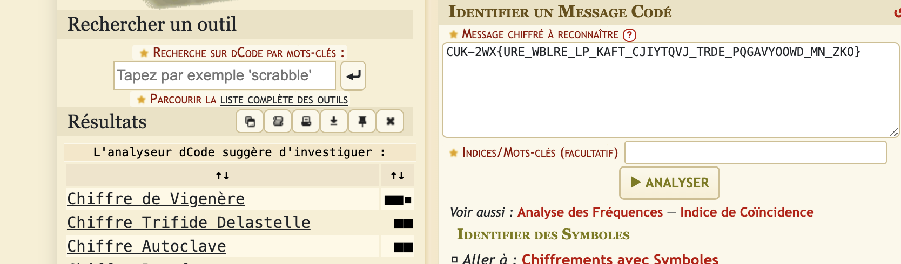

# Mini challenge d'onde

Sommaire:

- [Introduction](#introduction)
- [Sujet du challenge](#sujet-du-challenge)
- [Mise en place du challenge](#mise-en-place-du-challenge)
- [Solution du challenge](#solution-du-challenge)

## Introduction

Dans cette partie, nous proposons un challenge lié aux ondes. L’objectif de ce challenge est de réussir à récupérer une clé de chiffrement permettant de déchiffrer un message.

Pour participer à ce challenge, vous devez disposer d’une `Raspberry PI 3 B` avec `Raspberry PI OS (Legacy) Lite` installé. Vous aurez également besoin d’un fil.

Pour résoudre le challenge, vous devez posséder une antenne ***DVB-T+FM+DAB 820T2 & SDR*** et, pour notre solution, un ordinateur sous Windows.

## Sujet du challenge

Nous avons trouvé un appareil suite à l’apparition d’une chaîne de radio. Lorsque nous avons repéré l’appareil, nous avons réussi à récupérer un message.

```text
CUK-2WX{URE_WBLRE_LP_KAFT_CJIYTQVJ_TRDE_PQGAVYOOWD_MN_ZKO}
```

Quand cet appareil est branché, la station radio est rendue disponible, mais le son transmis n’est pas compréhensible. Votre mission est de trouver un moyen de comprendre ce qui est transmis par la station radio sur la fréquence `100.6` et de déchiffrer le message que nous avons récupéré.

## Mise en place du challenge

Pour mettre en place le challenge, suivez les étapes décrites dans la partie du [brouilleur d'onde](../brouilleur_d-onde) sans télécharger le code github car un autre code sera utilisé.

Une fois la `Raspberry PI` équipée de l’antenne faite à partir du fil, vous pouvez passer à la suite du challenge. Pour commencer, vous devez créer un fichier audio contenant la clé de chiffrement. Pour ce faire, nous avons utilisé le code disponible sur github [`https://github.com/solusipse/spectrology`](https://github.com/solusipse/spectrology).

Mais avant cela, nous avons créé une image au format BMP pour assurer la compatibilité avec le code GitHub. L’image utilisée est la suivante, convertie en BMP via un convertisseur en ligne disponible dans le dossier des ressources.
[`ressources`](./ressources/clef.bmp)


```bash
git clone https://github.com/solusipse/spectrology.git
cd spectrology
python spectrology.py ~/Desktop/clef.bmp -b 13000 -t 19000 -o ~/Desktop/clef.wav
```

De cette manière, nous avons transfomé le fichier `clef.bmp` en fichier audio `clef.wav` disponible dans le dossier [`ressources`](./ressources/clef.wav).

Nous pouvons maintenant procèder a la mise en place de ces différents éléments sur la `Raspberry PI`. Pour cela, vous pouvez exécuter les commandes suivante en tant que `root`, et transmettre le fichier `clef.wav` généré précédemment. Nous allons utiliser le code github [`https://github.com/ChristopheJacquet/PiFmRds`](https://github.com/ChristopheJacquet/PiFmRds) pour transmettre la clef via les ondes FM.

```bash
git clone https://github.com/ChristopheJacquet/PiFmRds
cd PiFmRds/src
make clean
make
```

Puis nous allons modifier le fichier `/etc/rc.local` pour pouvoir exécuter le code au démarrage de la `Raspberry PI`. La ligne est rajouté avant la ligne `exit 0`.

```text
/root/pi_fm_rds -audio /root/clef.wav -ps CTF-2SU -rt "CTF IOT" -freq 100.6 &
```

De cette manière lors du redémarrage de la `Raspberry PI`, le challenge sera disponible. Nous pouvons maintenant passer à sa résolution.

## Solution du challenge

Nous pouvons maintenant passer à la résolution du challenge. Pour cela, nous disposons d’une antenne ***DVB-T+FM+DAB 820T2 & SDR***. Nous allons installer le logiciel airspy qui permet de visualiser ce que l'antenne reçoit, le logiciel est [`airspy`](https://airspy.com/download/) (Dans le cas ou l'antenne n'est visible, cette [`video`](https://www.youtube.com/watch?v=j14irB3spPc) peut vous permettre de résoudre cela).

Nous avons donc l'antenne de branchée avec le logiciel `airspy`. Nous pouvons scanner la fréquence `100.6`.


Cette fréquence rend disponible un son qui semble se répéter mais n’est pas compréhensible. Nous allons ajouter des filtres pour diminuer les bruits parasites (en haute fréquence) causés par l’environnement.


Puis, nous allons effectuer un enregistrement de la séquence sur cette fréquence en suivant les étapes suivantes : `Sélectionner l'icône des trois traits horizontaux > Audio: Simple Recorder`, puis lancer un enregistrement pour obtenir au moins une séquence. Une fois cela effectué, vous pouvez utiliser `Audacity` pour ouvrir cet enregistrement.

Maintenant, vous pouvez importer cet enregistrement réalisé dans `audacity`. Sur `Audacity`, vous pouvez changer l’apparence de l’audio pour obtenir un spectrogramme, ce qui nous permet d’avoir la visualisation suivante.


Avec ce spectrogramme, nous pouvons visualiser des caractères qui donnent la chaîne :

```text
ABFEDJNMIOINMGDSMSANSIFL
```

Nous devons maintenant déterminer ce que le message cache. Pour cela, nous pouvons utiliser un site qui permet de déterminer le chiffrement probablement utilisé [`https://www.dcode.fr/identification-chiffrement`](https://www.dcode.fr/identification-chiffrement).



Nous pouvons déterminer que le chiffrement utilisé est probablement le `chiffrement de vigenère`. Nous pouvons donc utiliser [`cyberChef`](https://gchq.github.io/CyberChef/) pour déchiffrer le message.


Nous avons donc le message déchiffré

```text
CTF-2SU{LES_ONDES_FM_SONT_PRATIQUE_POUR_DISSIMILER_UN_MSG}
```
